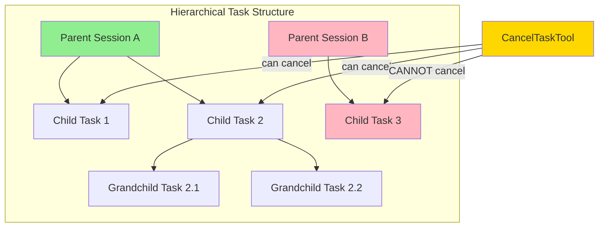

# Hierarchical Task Management

### From: cancel_task

Hierarchical task management organizes concurrent execution into parent-child relationships that reflect delegation patterns in multi-agent systems, where parent agents spawn specialized sub-agents to handle specific sub-problems. The `CancelTaskTool` implementation reveals this hierarchy through its session validation logic, which verifies that cancellation requests originate from the same session that created the task, establishing a clear ownership chain. This hierarchical structure enables several important capabilities: cascading cancellation where parent termination automatically propagates to children, resource accounting that aggregates consumption across task trees, and debugging support that correlates related executions through shared ancestry. The design parallels process group concepts in Unix systems and supervision trees in Erlang/OTP, where failure containment and lifecycle management operate on tree-structured relationships rather than flat task collections. Such hierarchies become essential as agent systems scale to handle complex workflows with dozens of concurrent sub-tasks, providing the organizational principles needed for observability, debugging, and reliable operation in production environments.

## Diagram

## External Resources

- [Erlang supervision principles](https://erlang.org/doc/design_principles/sup_princ.html) - Erlang supervision principles
- [Linux process groups and session management](https://man7.org/linux/man-pages/man2/setpgid.2.html) - Linux process groups and session management

## Sources

- [cancel_task](../sources/cancel-task.md)
