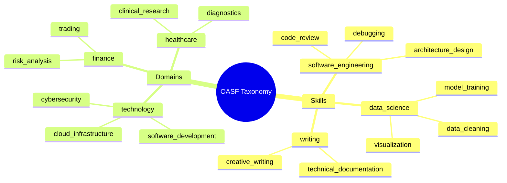

# Hierarchical Taxonomy for Agent Classification

### From: oasf

Hierarchical taxonomy systems provide structured classification mechanisms that enable semantic discovery and organization of AI agents across large populations. The OASF implementation includes dedicated structures for `OasfSkill` and `OasfDomain` annotations, each combining a human-readable hierarchical path with a numeric catalog identifier. This dual identification system balances human comprehension (through slash-delimited paths like `software_engineering/code_review`) with machine-efficient catalog lookups (through numeric IDs), supporting both browsing and programmatic retrieval patterns.

The skill taxonomy addresses the challenge of capability discovery in agent marketplaces and registries. Rather than relying on unstructured text descriptions, standardized skill annotations allow users to search for agents possessing specific capabilities regardless of implementation details. The hierarchical structure enables flexible matching strategies: exact matches for specialized requirements, parent-category matches for broader needs, or descendant traversal for comprehensive coverage. The informational nature of these annotations (explicitly noted as "not ragent skill invocation" in the source) clarifies that OASF skills describe advertised capabilities while actual skill implementation and invocation occur through the runtime-specific `skills` field in `RagentAgentPayload`.

Domain annotations similarly structure the problem space contexts in which agents operate, enabling filtering by industry vertical, technical domain, or organizational function. The combination of skill and domain taxonomies creates a two-dimensional classification space where agents can be located at the intersection of capability type and application context. This classification infrastructure supports emerging patterns in agent orchestration where systems automatically select appropriate agents based on task classification, and in agent marketplaces where browsing and recommendation systems depend on structured metadata.

## Diagram

## External Resources

- [SKOS Simple Knowledge Organization System reference](https://www.w3.org/TR/skos-reference/) - SKOS Simple Knowledge Organization System reference

## Sources

- [oasf](../sources/oasf.md)
