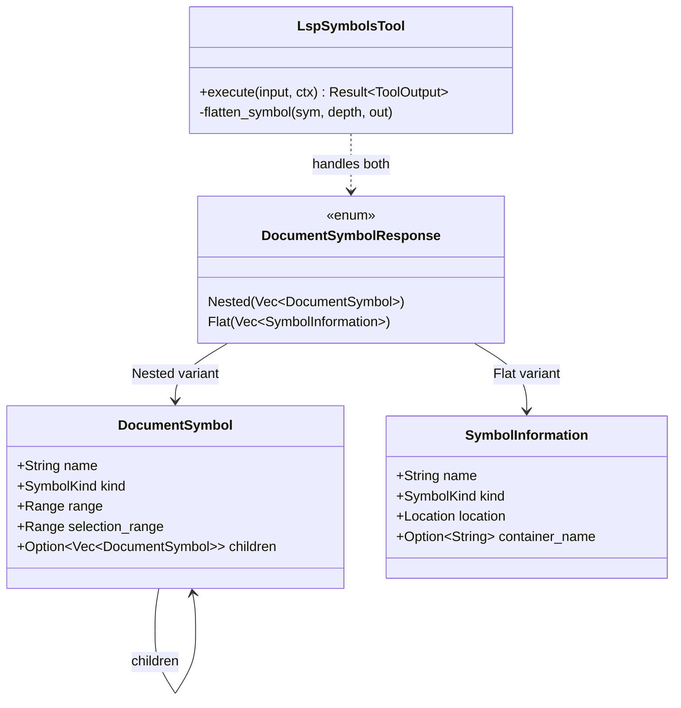

# Hierarchical vs Flat Symbol Representations

### From: lsp_symbols

The distinction between hierarchical and flat symbol representations reflects fundamental tradeoffs in how code structure is communicated to tools and users. Hierarchical representations preserve containment relationships—showing that a method belongs to a class, which belongs to a module—enabling tree-structured navigation and contextual understanding of symbol scope. Flat representations discard containment in favor of simple lists with absolute locations, prioritizing sortability and uniform access patterns over structural fidelity.

The LSP specification accommodates both approaches through `DocumentSymbolResponse`, which can be either `Nested(Vec<DocumentSymbol>)` or `Flat(Vec<SymbolInformation>)`. The `DocumentSymbol` type includes a `children` field enabling recursive descent, while `SymbolInformation` combines name, kind, and `Location` directly. This design recognizes that different consumers have different needs: an outline view requires hierarchy, while a global symbol search may prefer a flat, sorted list. The `LspSymbolsTool` implementation demonstrates pragmatic handling of both formats, normalizing them into a consistent textual representation that preserves depth information for nested structures.

The flattening algorithm used by `LspSymbolsTool` illustrates recursive tree traversal with accumulator patterns. The `flatten_symbol` function takes a symbol and depth, records the current symbol with its indentation level, then recursively processes any children with incremented depth. This produces a pre-order traversal that maintains parent-before-child ordering, suitable for line-oriented output with visual indentation. The space complexity is O(n) for n symbols, with the output vector growing to contain all flattened entries. For very deep hierarchies, recursion depth could theoretically overflow the stack, though in practice language nesting depths are limited.

Flat symbol lists require sorting to produce meaningful output, as LSP servers may return symbols in arbitrary order. The implementation sorts by line number, producing top-to-bottom file order that matches human reading patterns. This normalization is crucial for reproducibility—without sorting, identical queries might produce differently-ordered results depending on server implementation details. The choice between preserving hierarchy and flattening reflects broader software design tensions between information fidelity and processing convenience, with `LspSymbolsTool` choosing a middle path that presents hierarchical information in a flat, consistently-ordered format.

## Diagram

## External Resources

- [LSP DocumentSymbol type definitions](https://microsoft.github.io/language-server-protocol/specifications/specification-current/#documentSymbol) - LSP DocumentSymbol type definitions
- [Tree traversal algorithms on Wikipedia](https://en.wikipedia.org/wiki/Tree_traversal) - Tree traversal algorithms on Wikipedia

## Sources

- [lsp_symbols](../sources/lsp-symbols.md)
