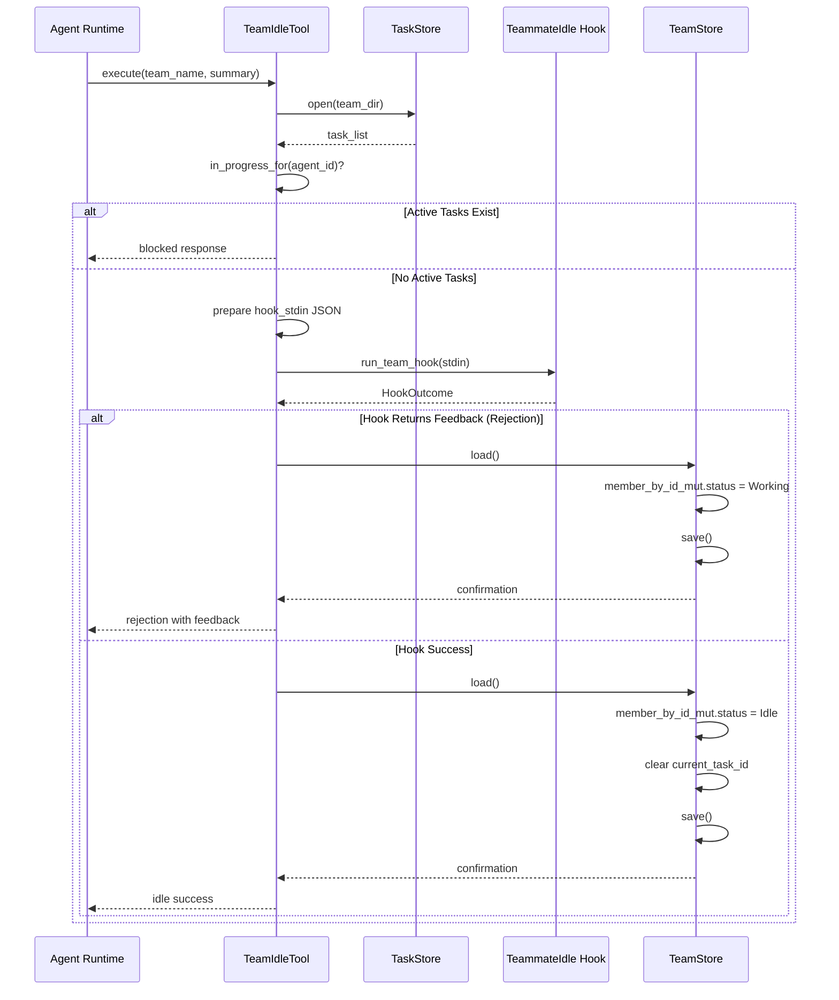

# Hook-Based Extensibility Patterns

### From: team_idle

The `TeammateIdle` hook in `TeamIdleTool` illustrates a powerful extensibility pattern where framework-defined lifecycle events delegate to user-configurable executable code, enabling customization without core modification. This architectural approach—common in mature systems like Git (hooks), Jenkins (build pipelines), and Kubernetes (admission controllers)—solves the tension between framework stability and application-specific requirements. The pattern separates invariant coordination logic (preventing idle with active tasks) from variable business rules (requiring minimum summary length, notifying external systems, implementing custom load balancing). The hook receives serialized context via stdin and returns success/failure through process exit codes or structured output, creating a language-agnostic extension boundary.

The specific implementation in ragent demonstrates several production considerations often overlooked in naive hook systems. First, hooks are optional (the code handles `HookOutcome` with pattern matching rather than panicking on absence), preserving framework functionality without configuration. Second, the hook's rejection path maintains system consistency: when `HookOutcome::Feedback` returns, the code explicitly resets `member.status = MemberStatus::Working`, preventing the agent from remaining in an ambiguous 'requested idle but rejected' state. Third, the stdin-based communication uses JSON for structured data exchange, supporting complex nested parameters while remaining parseable in shell scripts, Python, or compiled languages.

The pattern's power emerges from composition: multiple concerns can attach to the same hook point through wrapper scripts or process chaining, and hooks can themselves invoke other tools or APIs. A deployment might configure the `TeammateIdle` hook to: publish metrics to Prometheus, check a work queue for emergency assignments before permitting idle, require LLM-based validation that the summary meaningfully describes completed work, or notify human team leads through Slack. The async invocation (`run_team_hook().await`) permits non-blocking I/O during hook execution, though the implementation appears to await completion before proceeding—synchronous from the agent's perspective but non-blocking to the runtime. Trade-offs include hook execution latency affecting system responsiveness, and the need for careful sandboxing since hooks execute with the runtime's privileges.

## Diagram

## External Resources

- [Git Hooks documentation and examples](https://githooks.com/) - Git Hooks documentation and examples
- [Kubernetes admission controller pattern](https://kubernetes.io/docs/reference/access-authn-authz/extensible-admission-controllers/) - Kubernetes admission controller pattern
- [Rust process spawning for hook implementation](https://doc.rust-lang.org/std/process/struct.Command.html) - Rust process spawning for hook implementation

## Related

- [Agent State Machines in Distributed Systems](agent-state-machines-in-distributed-systems.md)
- [Task-Claim Coordination Protocols](task-claim-coordination-protocols.md)

## Sources

- [team_idle](../sources/team-idle.md)
