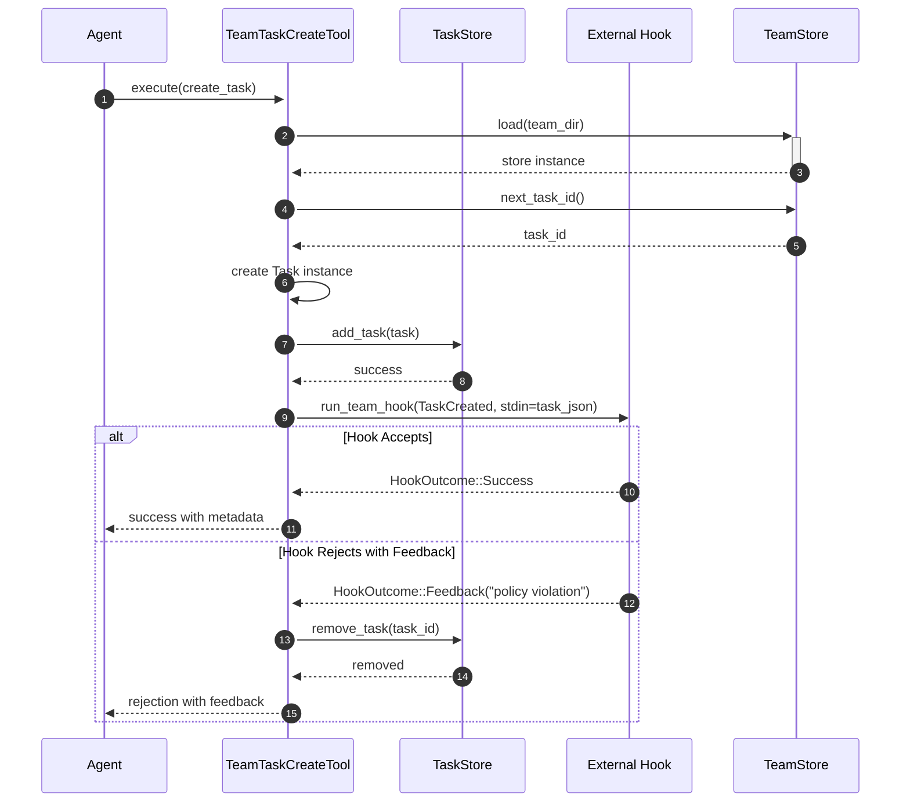

# Hook Pattern for Extensible Agent Behavior

### From: team_task_create

The hook pattern implemented in TeamTaskCreateTool provides a powerful extensibility mechanism for customizing agent behavior without modifying core tool implementations. By executing run_team_hook with HookEvent::TaskCreated after task persistence, the system enables external validation, notification, enrichment, or policy enforcement to participate in the task creation workflow. The pattern's sophistication is evident in its bidirectional communication: task metadata flows to hooks via stdin as JSON, while hook return values (HookOutcome) can influence transaction completion through the feedback-based rejection mechanism.

This implementation demonstrates post-commit validation with compensating transactions—a pattern borrowed from distributed systems architecture. Rather than attempting pre-validation that might miss race conditions or external state changes, the tool commits the task then offers hooks opportunity to reject with automatic rollback via remove_task. This approach prioritizes availability and simplicity over strict atomicity, accepting brief windows of inconsistency that are cleaned up if validation fails. The pattern is particularly appropriate for agent systems where validation may involve external service calls, human approval workflows, or computationally expensive policy checks that shouldn't block the critical path.

Hook extensibility transforms the tool from a closed component into a platform for organizational policy expression. Teams can implement custom hooks for diverse concerns: budget validation checking task estimates against remaining team allocations, compliance scanning ensuring descriptions don't contain prohibited terms, automatic labeling based on content analysis, or integration with external project management systems. The stdin-based communication follows Unix philosophy of text streams as universal interface, while the HookEvent enum suggests a structured event taxonomy enabling hooks to subscribe to specific lifecycle moments across multiple tools.

## Diagram

## External Resources

- [Hooking pattern in software development](https://en.wikipedia.org/wiki/Hooking) - Hooking pattern in software development
- [Compensating Transaction pattern by Martin Fowler](https://martinfowler.com/articles/patterns-of-distributed-systems/compensating-transaction.html) - Compensating Transaction pattern by Martin Fowler
- [12-Factor App: config through environment (relevant to hook configuration)](https://12factor.net/config) - 12-Factor App: config through environment (relevant to hook configuration)
- [Observer pattern (foundation for hook systems)](https://refactoring.guru/design-patterns/observer) - Observer pattern (foundation for hook systems)

## Related

- [Event-Driven Architecture](event-driven-architecture.md)

## Sources

- [team_task_create](../sources/team-task-create.md)
