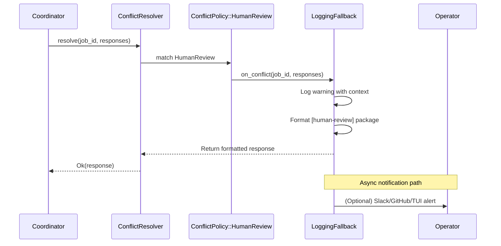

# Human-in-the-Loop Architecture

### From: policy

Human-in-the-loop (HITL) architecture describes system designs that strategically integrate human judgment into automated workflows, particularly at decision boundaries where machine confidence is insufficient or stakes warrant additional scrutiny. This concept fundamentally recognizes that fully autonomous operation, while desirable for scale and consistency, remains inadequate for scenarios involving novel situations, value-laden tradeoffs, or regulatory accountability requirements. The HITL pattern implemented in this policy module demonstrates a principled approach to graceful degradation: when automatic resolution strategies prove insufficient, the system transitions to human escalation rather than failing silently or producing arbitrarily selected outputs.

The architectural implementation centers on the HumanFallback trait, which abstracts the interface between the deterministic conflict resolver and potentially diverse human interaction channels. This trait-based design enables polymorphic integration with notification systems ranging from simple logging to real-time messaging platforms, issue tracking systems, or custom approval workflows. The trait contract specifies a single method accepting job context and response data, returning a resolved string that maintains type compatibility with fully automatic resolution paths. This design ensures that human intervention appears seamless to downstream consumers, preserving system interface stability while dramatically expanding resolution capabilities.

Production HITL systems must address significant operational challenges including latency tolerance, queue management, and accountability tracking. The implementation here acknowledges these concerns through clear logging of escalation events and structured formatting of human-review packages, but delegates specific operational mechanisms to implementing organizations. The LoggingFallback default implementation provides immediate visibility into escalation frequency and patterns, supporting data-driven decisions about policy tuning and potential automation opportunities. By measuring and surfacing human intervention rates, organizations can iteratively improve automatic policies or invest in additional agent training to reduce friction in common scenarios. This metrics-oriented approach to HITL design transforms human oversight from a cost center into a source of structured feedback for system improvement.

## Diagram

## External Resources

- [Wikipedia overview of human-in-the-loop computing](https://en.wikipedia.org/wiki/Human-in-the-loop) - Wikipedia overview of human-in-the-loop computing
- [Structured logging for observable distributed systems](https://docs.rs/tracing/latest/tracing/) - Structured logging for observable distributed systems

## Related

- [Conflict Resolution Policies](conflict-resolution-policies.md)

## Sources

- [policy](../sources/policy.md)
