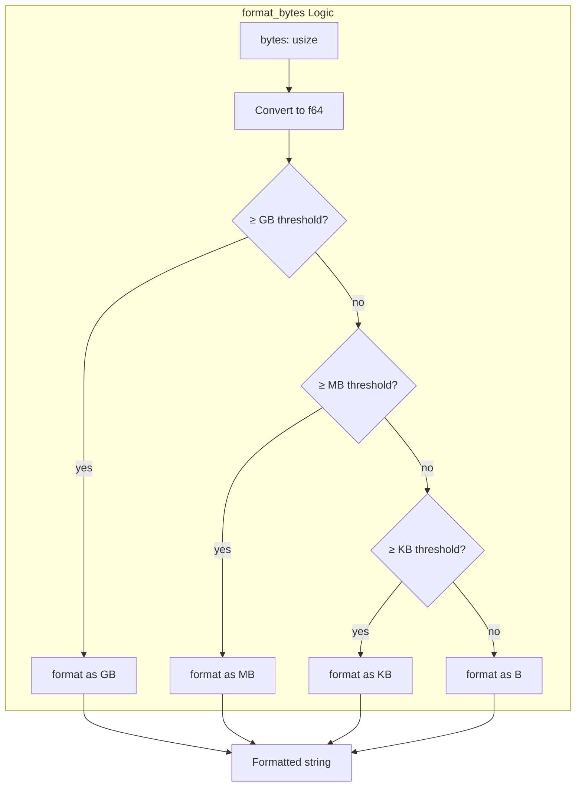

# Human-Readable Formatting

### From: format

The `format_bytes` function implements human-readable data size formatting, converting raw byte counts into scaled representations using binary prefixes (KiB, MiB, GiB conventions though displayed as KB, MB, GB). The function uses threshold-based tier selection with floating-point division to produce one-decimal precision outputs. Constants define the scale factors using binary 1024 multipliers: KB = 1024, MB = 1024², GB = 1024³. This approach balances precision with readability—showing "1.5 KB" rather than "1536 B" for intermediate values.

The implementation demonstrates defensive floating-point handling by converting the `usize` byte count to `f64` before division, enabling fractional results. The formatting uses Rust's `format!` macro with `:.1` precision specifier for consistent one-decimal output. Special handling ensures exact boundaries like 1024 bytes display as "1.0 KB" rather than "1 KB," maintaining visual consistency across the output range. The function's documented examples serve as implicit specification, showing expected behavior at representative points.

This human-readable formatting concept extends beyond bytes to the entire module's philosophy. The counting functions similarly transform raw numbers into contextual descriptions—"42 lines" carries more meaning than bare "42" in tool output. The `format_display_path` function applies the same principle to file system paths, preferring relative representations that are more meaningful to users than absolute paths when the context permits. Together these utilities embody the principle that machine-readable data should be presented in human-friendly forms without sacrificing precision or accuracy.

## Diagram

## External Resources

- [Binary prefix standards (KiB, MiB, GiB)](https://en.wikipedia.org/wiki/Binary_prefix) - Binary prefix standards (KiB, MiB, GiB)
- [Rust formatting macros and precision specifiers](https://doc.rust-lang.org/std/fmt/) - Rust formatting macros and precision specifiers

## Related

- [Pluralization Logic](pluralization-logic.md)
- [Content Format Patterns](content-format-patterns.md)

## Sources

- [format](../sources/format.md)
