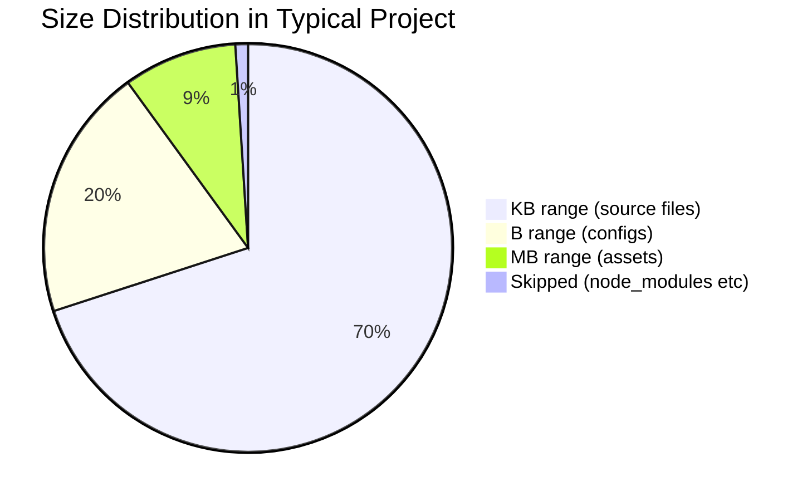

# Human-Readable Size Formatting

### From: list

Binary size formatting addresses the fundamental tension between precise byte counts and cognitive accessibility in data presentation. Raw byte values, while unambiguous, fail to convey magnitude intuition—distinguishing 1048576 from 1073741824 requires digit counting rather than immediate comprehension. The `format_size` function in `list.rs` implements the de facto standard of binary prefixes (KiB, MiB) though with abbreviated labels (KB, MB) that reflect common though technically imprecise usage. The implementation uses base-1024 thresholds (1024, 1024²) appropriate for filesystem allocations where blocks and sectors are power-of-two sized, with floating-point division and one-decimal precision balancing precision with readability.

The formatting strategy reveals implicit usability research embedded in the code. Three tiers are provided—bytes for small files where precision matters, kilobytes for the typical range of source files and documents, and megabytes for larger artifacts—with no provision for gigabytes or beyond. This reflects the expected use case of listing development project directories where multi-gigabyte files are exceptional and their precise size less relevant than their presence. The `{:.1}` format specifier ensures consistent decimal places, preventing layout jitter when scanning columns of sizes, while the conditional formatting avoids unnecessary decimal noise for small values. The choice of uppercase unit labels (B, KB, MB) follows IEC recommendations and distinguishes from bit-based units, though the absence of the 'i' infix (KiB vs KB) accepts common parlance over strict standard adherence.

Internationalization and accessibility considerations in size formatting extend beyond the immediate implementation. The hardcoded English labels and left-aligned formatting assume Western reading patterns; right-aligned numeric formatting with localized separators would improve scannability in tabular contexts. The function's `u64` input type accommodates modern filesystems with exabyte-scale capacities, though the output formatting would saturate at megabytes for the implemented tiers—this limitation is acceptable for the tool's scope but would require extension for general-purpose use. The `unwrap_or(0)` handling of missing metadata in the caller ensures that size display never fails, with zero serving as a sentinel for unknown that is visually distinguishable from small actual sizes.

The broader context of size formatting standards reflects ongoing industry evolution. The IEC 60027-2 standard introduced explicit binary prefixes (kibi, mebi, gibi) in 1998 to disambiguate from decimal SI prefixes, but adoption remains incomplete with operating systems and tools displaying inconsistent conventions. macOS and Windows typically use binary calculations with decimal labels (1 KB = 1024 B), while Linux tools increasingly adopt IEC precision. The `list.rs` implementation follows the common developer tool pattern of binary calculation with familiar labels, prioritizing intuition over standards compliance. The single-decimal precision provides sufficient granularity for typical file size comparisons while avoiding false precision—users can distinguish 1.5 MB from 2.5 MB meaningfully, while 1.54 MB vs 1.55 MB differences rarely inform decisions. This pragmatic approach to numeric presentation exemplifies how tool developers translate technical capabilities into user-aligned abstractions.

## Diagram

## External Resources

- [Wikipedia article on binary prefixes and IEC standardization](https://en.wikipedia.org/wiki/Binary_prefix) - Wikipedia article on binary prefixes and IEC standardization
- [NIST guide on SI prefixes and binary usage](https://www.nist.gov/pml/weights-and-measures/metric-si-prefixes) - NIST guide on SI prefixes and binary usage
- [Rust formatting syntax specification for precision control](https://doc.rust-lang.org/std/fmt/) - Rust formatting syntax specification for precision control

## Sources

- [list](../sources/list.md)
