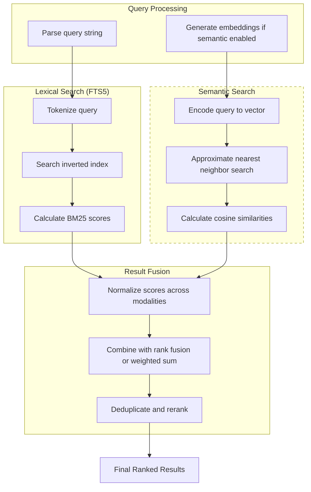

# Hybrid Search

### From: journal

Hybrid search refers to information retrieval systems that combine multiple search methodologies to improve result relevance, typically merging traditional lexical (keyword) search with semantic (vector similarity) search. The JournalSearchTool implements this concept by integrating SQLite's FTS5 full-text search with an optional embedding-based semantic search layer, attempting to capture both exact textual matches and conceptual similarities that might be missed by pure keyword approaches.

The technical implementation reveals pragmatic engineering decisions around search integration. The current codebase includes infrastructure for semantic search through the EmbeddingProvider trait and semantic availability checking, but notes that full integration with lazy-embedding of journal entries is deferred. This suggests an incremental deployment strategy where the architectural hooks for semantic enhancement are established before the complete implementation, allowing the system to function with FTS5 alone while preserving upgrade paths. The semantic flag in the search API defaults to true when embeddings are available, indicating intended predominance of hybrid approaches when feasible.

Result merging in hybrid systems presents significant challenges that the current implementation approaches cautiously. The code path shows FTS5 execution regardless of semantic availability, suggesting either temporary fallback behavior or preparation for future result fusion algorithms. True hybrid search typically requires score normalization across different ranking systems, reciprocal rank fusion, or learned combination models to merge keyword relevance scores with cosine similarity measures into unified rankings. The current implementation's focus on snippet generation and result presentation suggests that sophisticated merging logic remains future work, with the architecture positioned to accommodate such enhancements.

## Diagram

## External Resources

- [Overview of vector databases for semantic search](https://en.wikipedia.org/wiki/Vector_database) - Overview of vector databases for semantic search
- [Hybrid search concepts and implementation patterns](https://www.pinecone.io/learn/hybrid-search/) - Hybrid search concepts and implementation patterns
- [OpenAI's guide to embeddings for semantic search](https://platform.openai.com/docs/guides/embeddings/what-are-embeddings) - OpenAI's guide to embeddings for semantic search

## Sources

- [journal](../sources/journal.md)
