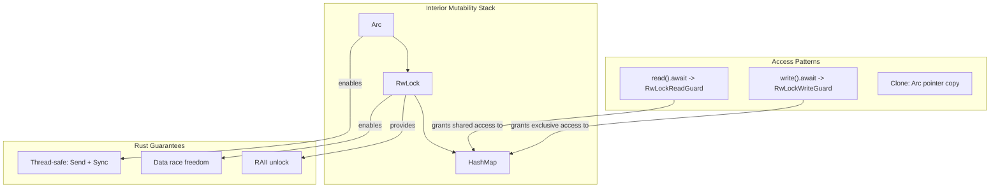

# Interior Mutability Patterns in Async Rust

### From: registry

Interior mutability patterns enable shared mutation of data through controlled synchronization primitives, essential for Rust's ownership model when multiple tasks require mutable access. This implementation demonstrates sophisticated use of Arc<RwLock<T>>—atomic reference counting combined with a read-write lock—to provide thread-safe, async-compatible shared state. The pattern appears in AgentRegistry's inner field, allowing Clone implementation while maintaining mutable access across async boundaries.

The Arc<RwLock<HashMap<...>>> structure composes three layers of abstraction. Arc provides shared ownership with atomic reference counting, automatically freeing memory when the last reference drops. RwLock distinguishes read-heavy from write-heavy access, permitting concurrent reads while serializing writes—appropriate for registry workloads where agent lookup and matching dominate mutations. The HashMap provides O(1) key-based access for the core registry operations. This triple wrapping is idiomatic for async Rust shared state but incurs allocation overhead and cache locality costs compared to single-owner patterns.

Async-aware lock acquisition uses .await-compatible methods: read().await for shared access and write().await for exclusive access. These async methods avoid blocking OS threads, instead parking the task in Tokio's scheduler until the lock becomes available. The implementation demonstrates RAII guard patterns—lock guards released when variables drop—ensuring no deadlock from forgotten unlocks. However, holding guards across .await points (as seen in prune_stale's key collection phase) can limit concurrency; the alternative of collecting keys before acquiring write lock represents a deliberate optimization.

Clone derive on AgentRegistry enables cheap registry sharing—cloning only duplicates the Arc pointer, not the underlying data—supporting patterns where multiple system components hold registry references. Default derive complements this by enabling initialization without explicit constructor calls. These patterns collectively demonstrate how Rust's type system encodes concurrency invariants: Send + Sync bounds on Responder, 'static requirements on spawned tasks, and the compile-time guarantee that data races are impossible without unsafe code.

## Diagram

## External Resources

- [Rust standard library RwLock documentation](https://doc.rust-lang.org/std/sync/struct.RwLock.html) - Rust standard library RwLock documentation
- [Tokio tutorial: Shared state with Arc and Mutex](https://tokio.rs/tokio/tutorial/shared-state) - Tokio tutorial: Shared state with Arc and Mutex
- [Understanding blocking in async Rust](https://ryhl.io/blog/async-what-is-blocking/) - Understanding blocking in async Rust

## Related

- [interior-mutability](interior-mutability.md)
- [zero-cost-abstractions](zero-cost-abstractions.md)

## Sources

- [registry](../sources/registry.md)
