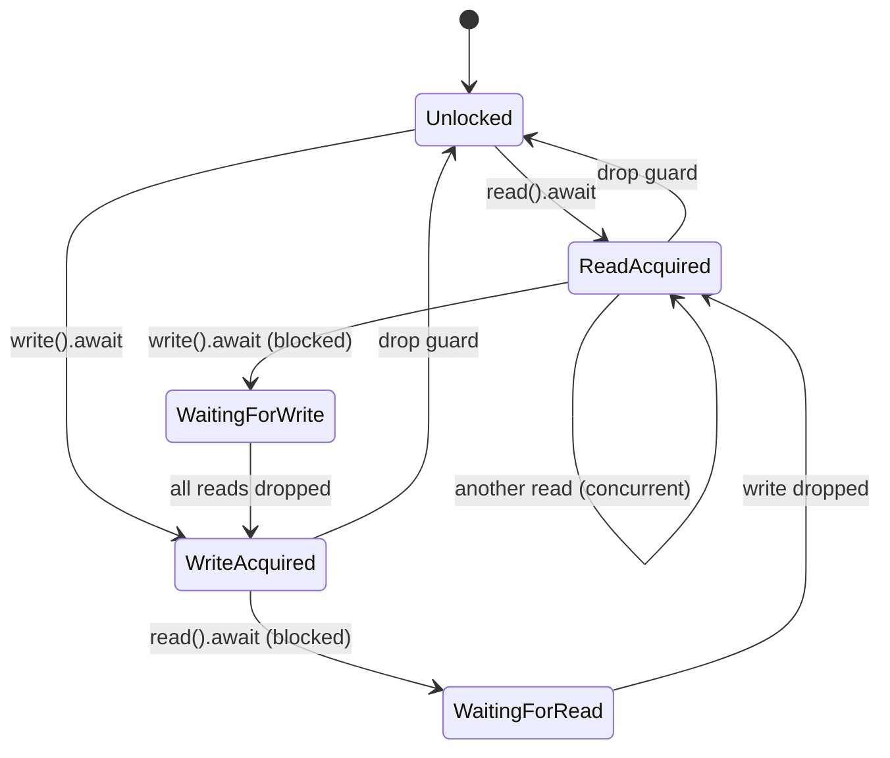

# Interior Mutability with Arc<RwLock>

### From: mod

Interior mutability through Arc<RwLock<T>> represents a foundational pattern for shared mutable state in Rust's async ecosystem, enabling multiple owners of data with thread-safe concurrent access. The TaskManager employs this pattern for both its tasks and cancel_flags fields, allowing the struct itself to remain non-mut while its contents can be modified through the lock guards. Arc (atomic reference counting) provides shared ownership with automatic cleanup when the last reference drops, essential for state that must outlive any single async task or function call. RwLock (read-write lock) distinguishes between read and write access, permitting multiple concurrent readers or a single exclusive writer, optimizing for the common case of many status checks with infrequent updates.

The async-aware RwLock from tokio::sync differs critically from std::sync::RwLock: the async version yields control to the runtime when contention occurs rather than blocking the OS thread, preserving runtime responsiveness and preventing thread pool exhaustion. This is essential in the TaskManager where background tasks may contend with the main session processor for access to task state. The pattern requires careful attention to lock duration—holding a write lock across await points can cause contention and potential deadlocks, so the implementation acquires locks in tight scopes, performs mutations, and releases before awaiting further operations. The cancel_flags field demonstrates a hybrid approach: the HashMap itself is RwLock-protected, but the contained AtomicBool values provide lock-free cancellation checks within the agent processing loop.

Error handling with this pattern requires awareness that lock operations can fail (though Tokio's async locks don't poison like std locks) and that lock guards have drop-based release semantics. The implementation uses .write().await and .read().await to acquire guards, with the await points explicit in the async signature. For complex mutations, the code pattern is: acquire write lock, get mutable reference via get_mut(), modify, and let guard drop at scope end. This pattern appears throughout spawn_sync and spawn_background for task registration, status updates, and cleanup. The choice of HashMap over concurrent collections like DashMap reflects preference for standard library patterns and explicit lock semantics over potential performance optimizations, with the expectation that task counts remain manageable (dozens to hundreds, not millions) and lock contention minimal due to brief hold times.

## Diagram

## External Resources

- [Rust atomic types and memory ordering](https://doc.rust-lang.org/stable/std/sync/atomic/) - Rust atomic types and memory ordering
- [Tokio RwLock documentation and examples](https://docs.rs/tokio/latest/tokio/sync/struct.RwLock.html) - Tokio RwLock documentation and examples
- [Understanding blocking in async Rust](https://ryhl.io/blog/async-what-is-blocking/) - Understanding blocking in async Rust

## Sources

- [mod](../sources/mod.md)
