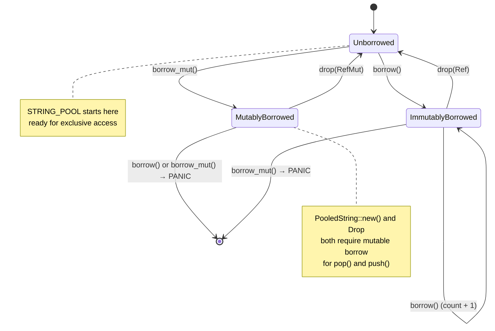

# Interior Mutability

### From: pool

Interior mutability is a Rust design pattern that allows mutation of data through immutable references, shifting borrow checking from compile-time to runtime. This module's pooling implementation relies fundamentally on interior mutability through `RefCell<Vec<String>>`, enabling the thread-local pool to be mutated despite being accessed through the immutable reference provided by `thread_local!::with`. Understanding this pattern is essential to understanding why the code is structured as it is. In standard Rust, `&T` references forbid mutation while `&mut T` references permit it, with the compiler enforcing that mutable references are exclusive. This works well for many cases but creates problems when aliasing is desired or required by other constraints. The `thread_local!` API provides `&T` access because it must handle initialization and potential reentrancy concerns safely. Without interior mutability, the pool would be immutable after initialization, rendering it useless. `RefCell` solves this by using a runtime borrow flag that tracks whether the contained value is currently borrowed mutably, immutably, or not at all.

The module uses two `RefCell` methods: `borrow()` for read-only access when checking pool statistics (`pool_stats()`), and `borrow_mut()` for write access when popping or pushing strings. These methods return `Ref<T>` and `RefMut<T>` smart pointers that automatically release the borrow when dropped. If borrowing rules are violated at runtime—such as calling `borrow_mut()` while a `borrow()` is active—the thread panics rather than causing undefined behavior. This preserves Rust's safety guarantee while providing flexibility. For this module's use case, the borrow patterns are simple and short-lived: acquire, pop/push, release. There's no risk of holding borrows across await points or complex control flow that might cause panics. An alternative would be `Cell`, which provides interior mutability by copying values, but this is unsuitable for `Vec<String>` which is not `Copy`. `Mutex` or `RwLock` could provide thread-safe interior mutability, but would introduce synchronization overhead unnecessary given the thread-local design. `RefCell` represents the optimal choice: single-threaded interior mutability with minimal overhead.

## Diagram

## External Resources

- [The Rust Programming Book: Interior Mutability](https://doc.rust-lang.org/book/ch15-05-interior-mutability.html) - The Rust Programming Book: Interior Mutability
- [Rust std::cell module documentation](https://doc.rust-lang.org/std/cell/) - Rust std::cell module documentation
- [MIT Rust course on interior mutability patterns](https://web.mit.edu/rust-lang_v1.25/arch/amd64_ubuntu1404/share/doc/rust/html/book/second-edition/ch15-05-interior-mutability.html) - MIT Rust course on interior mutability patterns

## Related

- [Thread-Local Storage](thread-local-storage.md)

## Sources

- [pool](../sources/pool.md)
