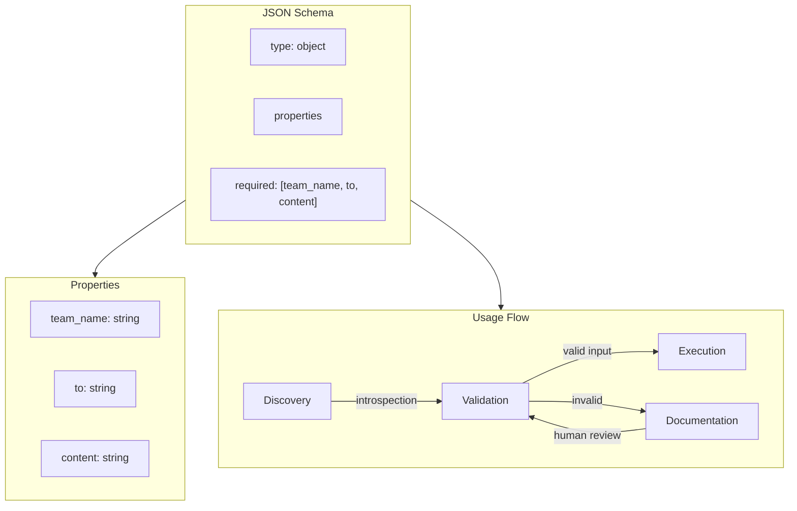

# JSON Schema as API Contracts

### From: team_message

JSON Schema as API contracts represents the practice of using declarative schema definitions to specify the shape and constraints of data interfaces, enabling automated validation, documentation generation, and client code synthesis. The `TeamMessageTool::parameters_schema` method returns a JSON Schema object describing required fields (`team_name`, `to`, `content`), their types, and human-readable descriptions. This approach transforms what might be implicit conventions into explicit, machine-verifiable contracts that govern tool invocation.

The schema structure shown follows JSON Schema Draft 7 conventions, using `"type": "object"` for the root, `"properties"` for field definitions, and `"required"` to specify mandatory fields. Each property includes a `"description"` intended for human consumption, supporting generated documentation and IDE tooltips. This self-describing capability is particularly valuable in multi-agent systems where tools may be discovered dynamically and presented to users or other agents without prior knowledge of their requirements. The schema enables runtime validation of inputs before tool execution, catching errors early and providing precise feedback about constraint violations.

In the broader ecosystem of language models and agentic AI, JSON Schema serves as a bridge between natural language understanding and structured tool invocation. When an agent parses a user's request like "tell Alice the project is ready", the schema constraints help constrain generation to valid JSON structures that can be safely parsed and passed to `execute`. The type specificity—requiring strings for all parameters—prevents type confusion attacks where malformed inputs might exploit weakly-typed interfaces. The requirement that all three fields be present eliminates an entire class of errors from missing parameters, pushing validation to the system boundary rather than sprinkling checks throughout execution logic.

The evolution of JSON Schema in this context suggests potential extensions not shown in the basic example: conditional schemas where certain parameters require others, enumerated values for constrained choices, pattern validation for agent ID formats, or even dynamic schemas that reflect current team membership. More sophisticated implementations might integrate with JSON Schema validation libraries at the framework level, automatically rejecting invalid inputs before they reach tool implementations. The metadata field in `ToolOutput` similarly invites schema definition for return values, enabling type-safe consumption of tool results and supporting composition patterns where one tool's output feeds into another's input.

## Diagram

## External Resources

- [JSON Schema understanding guide](https://json-schema.org/understanding-json-schema/) - JSON Schema understanding guide
- [OpenAI function calling with JSON Schema](https://platform.openai.com/docs/guides/function-calling) - OpenAI function calling with JSON Schema
- [Schemars crate for JSON Schema generation in Rust](https://docs.rs/schemars/latest/schemars/) - Schemars crate for JSON Schema generation in Rust

## Sources

- [team_message](../sources/team-message.md)
