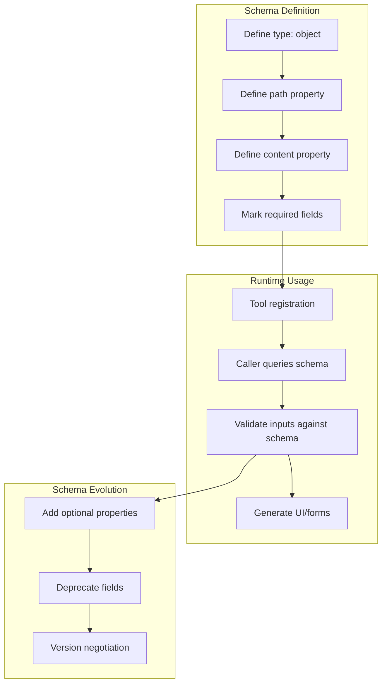

# JSON Schema for Tool Interfaces

### From: write

JSON Schema for tool interfaces is a design pattern employed in the ragent framework to provide self-describing, validated contracts between tools and their callers, implemented in `WriteTool` through the `parameters_schema` method. This approach defines the expected structure of tool inputs using JSON Schema format—a standardized vocabulary for annotating and validating JSON documents—enabling automatic validation, documentation generation, and UI construction without requiring manual synchronization between implementation and consumers. The `WriteTool`'s schema explicitly declares its requirements: an object with "path" and "content" string properties, both marked as required fields, creating an unambiguous contract for what constitutes valid input.

The architectural significance of JSON Schema in tool interfaces extends to interoperability and ecosystem integration within agent systems. By returning schema information at runtime, tools become introspectable components that can be discovered and utilized by generic agent frameworks, IDE plugins, or automated testing systems without hard-coded knowledge of specific tool implementations. This introspection capability is particularly valuable in LLM-based agents where the model may need to understand tool capabilities to select appropriate actions, or where user interfaces must dynamically present input forms based on tool requirements. The schema also serves as documentation that remains synchronized with implementation, as the `parameters_schema` method returns the authoritative definition used for validation.

The implementation of JSON Schema in `WriteTool` using Serde JSON's `json!` macro demonstrates a lightweight, code-coupled approach to schema definition that prioritizes developer ergonomics. Rather than maintaining separate schema files that risk divergence from implementation, the schema is constructed programmatically within the Rust code, ensuring that changes to parameter requirements are immediately reflected in the schema output. This pattern supports progressive enhancement—tools can start with simple schemas and evolve to include more sophisticated features like conditional subschemas, value constraints, or detailed descriptions—while maintaining backwards compatibility through schema versioning strategies. The metadata output in `ToolOutput` further extends this self-describing philosophy by providing structured information about execution results.

## Diagram

## External Resources

- [JSON Schema specification and documentation](https://json-schema.org/) - JSON Schema specification and documentation
- [Schemars Rust library for JSON Schema generation](https://docs.rs/schemars/latest/schemars/) - Schemars Rust library for JSON Schema generation

## Sources

- [write](../sources/write.md)

### From: gitlab_pipelines

JSON Schema serves as the declarative contract language for tool interfaces in modern AI agent systems. It provides a machine-readable, standardized format for describing the structure, types, and constraints of tool parameters, enabling automatic validation, documentation generation, and UI construction. The schema specification supports rich type systems including primitives, objects, arrays, enums, and complex nested structures, with validation keywords for constraints like required fields, pattern matching, and numeric ranges.

In this implementation, each tool's parameters_schema method returns a serde_json::Value containing a JSON Schema object. The schemas specify type constraints (object root with typed properties), enumerations for status filters (limiting to valid GitLab states), and descriptions that guide both human users and language models in correct parameter formation. For example, GitlabListPipelinesTool defines optional status with an enum of pipeline states, optional ref for branch/tag filtering, and limit with integer type and descriptive bounds. This schema-driven approach eliminates ambiguity in tool invocation and enables runtime validation before API calls are attempted.

The practical benefits of JSON Schema interfaces include reduced error rates through upfront validation, improved model performance through clear parameter documentation, and interoperability with schema-aware tooling. Validation errors can be propagated back to language models for self-correction, creating robust interaction loops. The approach aligns with OpenAPI specifications and emerging standards for AI tool definitions, positioning implementations for integration with broader ecosystem tooling like API gateways, documentation generators, and testing frameworks.
