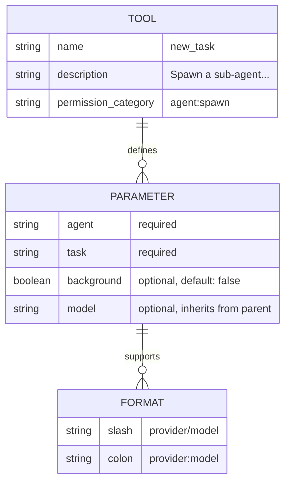

# JSON Schema Parameter Definition

### From: new_task

The JSON schema parameter definition in `NewTaskTool` demonstrates structured parameter validation through runtime schema generation, leveraging `serde_json::json!` macro for declarative schema construction. The `parameters_schema` method returns a `Value` representing a JSON Schema object that defines expected types, descriptions, and validation constraints for tool invocation. This approach enables both programmatic validation and potential integration with schema-aware tooling like IDE autocomplete, API documentation generators, or LLM function calling interfaces.

The schema defines four parameters with varying constraints. The `agent` parameter accepts strings with enumerated examples ('explore', 'build', 'plan', 'general') suggesting extensible agent registry. The `task` parameter is a free-form string for instructions. The `background` boolean includes extensive documentation explaining concurrency semantics and usage constraints—required for multiple simultaneous tasks, blocking when false. The optional `model` parameter accepts provider/model identifiers in two formats: slash-separated ('anthropic/claude-sonnet-4-20250514') or colon-separated ('openai:gpt-4o'), demonstrating format flexibility for different provider conventions. The `required` array explicitly lists `agent` and `task` as mandatory, with `background` and `model` defaulting through runtime logic rather than schema defaults.

This schema-driven approach separates interface definition from implementation, enabling multiple validation layers. The `execute` method performs additional runtime validation beyond schema constraints—checking `task_manager` initialization, `team_context` presence, and parameter extraction with specific error messages. The combination of declarative schema and imperative validation provides defense in depth: schema catches structural issues early, while runtime checks handle semantic constraints and context-dependent availability. This pattern is particularly valuable for LLM-facing tools where the schema may be exposed directly to language models for function calling, while the implementation handles complex runtime state validation that cannot be expressed in JSON Schema.

## Diagram

## External Resources

- [JSON Schema specification and documentation](https://json-schema.org/) - JSON Schema specification and documentation
- [OpenAI function calling guide for JSON schema usage](https://platform.openai.com/docs/guides/function-calling) - OpenAI function calling guide for JSON schema usage

## Sources

- [new_task](../sources/new-task.md)
