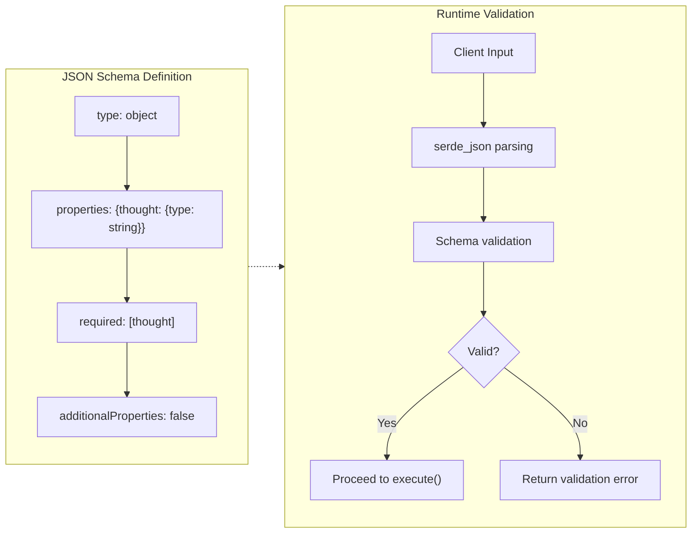

# JSON Schema Validation for Tool Interfaces

### From: think

JSON Schema validation for tool interfaces is a structural contract pattern that defines the shape and constraints of tool inputs using a standardized schema language, enabling runtime validation, automatic documentation generation, and client-side form building. The parameters_schema method in ThinkTool returns a JSON Schema object describing the required "thought" string parameter, demonstrating how agent frameworks can maintain type safety and user experience across language boundaries. This pattern bridges the gap between strongly-typed Rust implementations and dynamically-typed client interactions, particularly important when agents are invoked through APIs or natural language interfaces where input validation cannot rely on compile-time type checking.

The schema serves multiple purposes beyond validation. It enables IDE integration where developers see parameter documentation inline. It supports automatic UI generation in agent playgrounds, where web interfaces can render appropriate input controls based on schema types (string fields as text areas, enums as dropdowns, numbers as sliders). It facilitates testing by providing a machine-readable contract that can be validated against example inputs. The use of additionalProperties: false in ThinkTool's schema demonstrates defensive design—rejecting unexpected parameters prevents typographical errors in parameter names from silently being ignored, a common source of bugs in dynamically-typed interfaces.

In the broader context of AI tooling standards, JSON Schema aligns with emerging specifications like the Model Context Protocol (MCP), OpenAPI, and JSON-RPC. The ThinkTool implementation uses serde_json's json! macro for schema construction, which provides compile-time checking of JSON structure while maintaining the flexibility to compose schemas dynamically. This approach balances the rigidity needed for reliable interfaces with the flexibility to support schema evolution—new optional parameters can be added without breaking existing clients, while schema versioning can manage more significant changes. For multi-language agent ecosystems, JSON Schema serves as a lingua franca, enabling Rust-implemented tools to be called from Python clients or JavaScript frontends with consistent validation semantics.

## Diagram

## External Resources

- [JSON Schema specification and documentation](https://json-schema.org/) - JSON Schema specification and documentation
- [Anthropic's Model Context Protocol (MCP) for tool standards](https://www.anthropic.com/news/model-context-protocol) - Anthropic's Model Context Protocol (MCP) for tool standards
- [OpenAPI Specification for API contracts](https://spec.openapis.org/oas/latest.html) - OpenAPI Specification for API contracts

## Sources

- [think](../sources/think.md)
