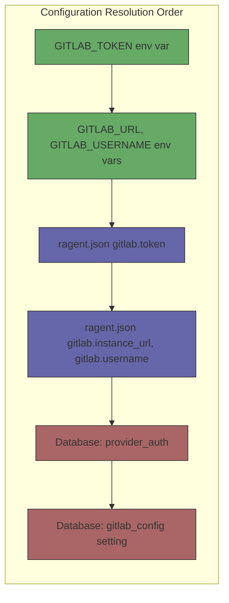

# Layered Configuration Resolution

### From: auth

Layered configuration resolution is a design pattern where application settings are drawn from multiple sources with defined precedence rules, allowing more specific or secure sources to override more general ones. In the ragent GitLab module, this pattern implements a three-tier hierarchy: environment variables (highest priority), JSON configuration files (`ragent.json`), and encrypted database storage (lowest priority). This approach balances security, flexibility, and usability—environment variables enable CI/CD pipelines and container deployments to inject secrets without file modifications, while file and database storage support interactive user configuration persistence.

The implementation demonstrates sophisticated handling of partial configuration, where individual fields can originate from different sources. The `load_config` function constructs configuration by starting with database values, then overlaying file-based settings, and finally applying environment variable overrides. This granular merging—rather than all-or-nothing source selection—maximizes configuration flexibility. For example, a user might store their instance URL in `ragent.json` while injecting a sensitive token through `GITLAB_TOKEN` environment variable. The pattern also facilitates secure secret rotation: updating a token in the environment immediately takes effect without file modifications or database migrations.

This configuration pattern has become standard in cloud-native and twelve-factor applications, where environment-based configuration supports horizontal scaling and ephemeral compute environments. The explicit priority documentation in code comments (`//! Resolution priority (highest wins)`) demonstrates maintainability best practices, ensuring future developers understand the intentional design. The pattern's drawback—potential confusion when settings appear inconsistent—requires clear diagnostic tooling, suggested by the comprehensive validation function that tests token validity against actual API endpoints.

## Diagram

## External Resources

- [Twelve-Factor App configuration best practices](https://12factor.net/config) - Twelve-Factor App configuration best practices
- [Rust CLI book - configuration patterns](https://rust-cli.github.io/book/in-depth/config-files.html) - Rust CLI book - configuration patterns

## Sources

- [auth](../sources/auth.md)
