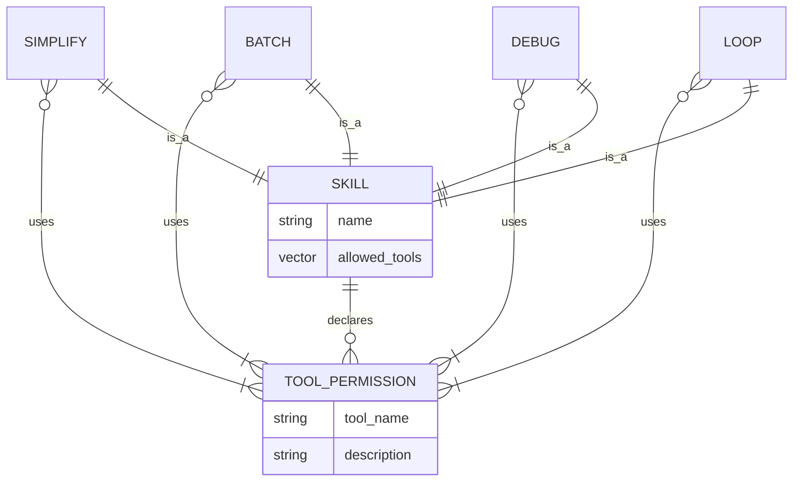

# Least-Privilege Tool Permissions

### From: bundled

Least-privilege tool permissions represent a security and safety design principle where each software component is granted exactly the minimum access rights required for its legitimate function, and no more. In ragent's skill system, this principle manifests through the `allowed_tools` field in SkillInfo, which explicitly enumerates which tools—bash shell execution, file reading, content editing, pattern searching, file globbing, and file creation—a skill may invoke. This explicit permission model transforms implicit capabilities into declared, auditable, and enforceable constraints, reducing the attack surface and preventing accidental misuse.

The implementation in bundled.rs demonstrates thoughtful application of this principle through differential permission assignment. The `simplify` skill receives broad permissions including bash, read, grep, glob, create, and write, reflecting its comprehensive code review responsibilities. The `batch` skill loses write in favor of edit, emphasizing modification over creation, while `debug` is restricted to bash, read, and grep for diagnostic operations. The `loop` skill receives minimal permissions—just bash and read—as its scheduling nature implies repeated execution where broad permissions would amplify risk. The consistent inclusion of bash across all skills acknowledges shell execution as foundational, while its restriction to explicitly allowed skills prevents arbitrary command injection.

This permission model serves multiple purposes beyond security. It functions as documentation, making each skill's operational envelope immediately visible to reviewers and users. It enables static analysis, where tooling can verify that skill bodies only invoke declared tools. It supports capability-based testing, where mocks can be configured for exact permission sets. It facilitates sandboxing, where execution environments can restrict available system calls based on declared needs. The `test_bundled_skills_have_allowed_tools` validation ensures this contract is maintained, verifying that every bundled skill has non-empty permissions and includes bash access. Future extensions might implement permission composition for skill chaining, runtime permission elevation requests with user confirmation, and integration with operating system sandboxing mechanisms for defense in depth.

## Diagram

## External Resources

- [Principle of least privilege - foundational security concept](https://en.wikipedia.org/wiki/Principle_of_least_privilege) - Principle of least privilege - foundational security concept
- [NCSC cyber security design principles - including least privilege guidance](https://www.ncsc.gov.uk/collection/cyber-security-design-principles) - NCSC cyber security design principles - including least privilege guidance

## Sources

- [bundled](../sources/bundled.md)
