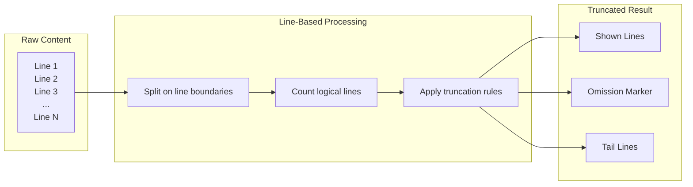

# Line-Based Content Truncation

### From: truncate

Line-based content truncation represents a fundamental text processing technique that operates on logical line boundaries rather than character positions, preserving the structural integrity of formatted output such as source code, log files, tabular data, and configuration files. This approach contrasts with character-based truncation which might split words, break syntax, or produce visually garbled output by cutting mid-line. The implementation in truncate.rs demonstrates sophisticated handling of line-oriented data using Rust's `lines()` iterator, which correctly recognizes Unix (`\n`), Windows (`\r\n`), and legacy Mac (`\r`) line endings, ensuring cross-platform compatibility. The technique proves essential for tool output management where readability and context preservation matter—truncating a compiler error message mid-line would obscure critical file path and line number information, while line-based truncation maintains navigable references. The module extends basic truncation with head-tail preservation, acknowledging that important information often appears at both the beginning (headers, summaries) and end (conclusions, stack traces, final status) of tool outputs. This pattern appears throughout Unix tooling, from `head` and `tail` commands to `journalctl` and `dmesg` output limiting, representing a mature approach to information density management in command-line interfaces.

## Diagram

## External Resources

- [Rust str::lines documentation explaining line ending handling](https://doc.rust-lang.org/std/primitive.str.html#method.lines) - Rust str::lines documentation explaining line ending handling
- [POSIX head utility specification showing line-based truncation standard](https://pubs.opengroup.org/onlinepubs/9699919799/utilities/head.html) - POSIX head utility specification showing line-based truncation standard
- [GNU coreutils head command documentation for comparison](https://www.gnu.org/software/coreutils/manual/html_node/head-invocation.html) - GNU coreutils head command documentation for comparison

## Sources

- [truncate](../sources/truncate.md)
