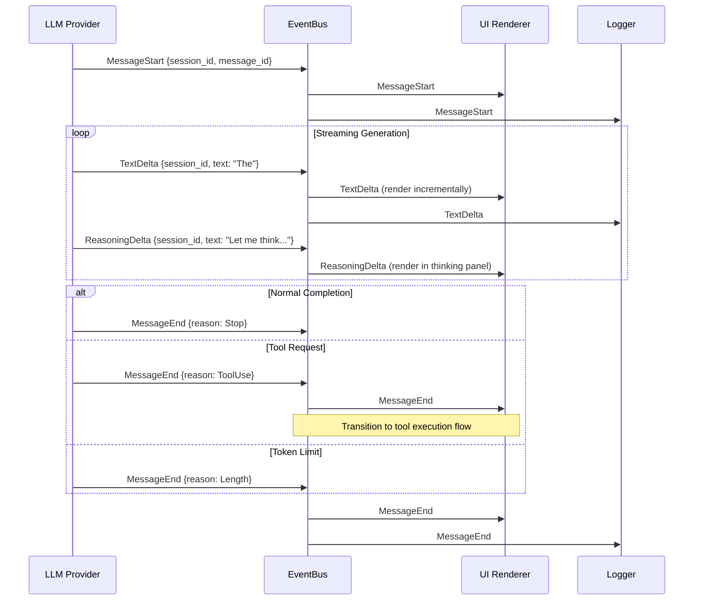

# LLM Response Streaming

### From: mod

LLM response streaming is the practice of delivering large language model outputs incrementally as they are generated, rather than buffering complete responses before transmission. The ragent-core event module implements this through a carefully designed sequence of event types that model the streaming lifecycle: MessageStart marks the beginning of assistant message generation, TextDelta and ReasoningDelta carry incremental content chunks, and MessageEnd signals completion with a FinishReason explaining why generation stopped. This architecture enables responsive user interfaces that display content as it arrives, significantly improving perceived performance and user experience.

The distinction between TextDelta and ReasoningDelta reflects modern LLM capabilities where models generate chain-of-thought reasoning (like OpenAI's o1 models or Anthropic's extended thinking) separately from final outputs. Separating these into distinct event types allows the UI to render them differently—perhaps showing reasoning in a collapsible panel or different styling—while maintaining the same streaming semantics. Both carry session_id for correlation and text for the incremental content. The delta naming convention (rather than "chunk" or "fragment") aligns with industry standards like OpenAI's streaming API, where each SSE event contains a delta field with incremental content.

The MessageEnd event's FinishReason field provides crucial signal for downstream processing. Stop indicates natural completion where the model chose to end; ToolUse signals the model requests tool execution, triggering the tool call flow; Length indicates truncation due to token limits, potentially requiring continuation strategies; ContentFilter reveals safety intervention; and Cancelled captures user-initiated interruption. This granularity enables appropriate responses: ToolUse transitions to tool execution, Length might prompt continuation requests, and ContentFilter could trigger escalation or alternative prompting. The ModelResponse event provides an alternative for non-streaming scenarios, delivering complete text with timing and token usage metrics.

The streaming architecture acknowledges practical constraints. The TODO comment about Cow<'static, str> suggests awareness that many text fields could be static strings (known tool names, permission types), and using copy-on-write types could reduce allocations. The event system's broadcast nature means all receivers see all deltas, which could be optimized for receivers only needing final results, but the simplicity outweighs the overhead for ragent's use case. The duration_ms in ToolCallEnd and elapsed_ms in ModelResponse provide wall-clock timing for performance monitoring, complementing the TokenUsage event's provider-reported token counts for comprehensive cost and latency analysis.

## Diagram

## External Resources

- [OpenAI streaming API documentation](https://platform.openai.com/docs/api-reference/chat/streaming) - OpenAI streaming API documentation
- [Server-Sent Events (SSE) - Web APIs | MDN](https://developer.mozilla.org/en-US/docs/Web/API/Server-sent_events) - Server-Sent Events (SSE) - Web APIs | MDN

## Related

- [Event-Driven Architecture](event-driven-architecture.md)

## Sources

- [mod](../sources/mod.md)
