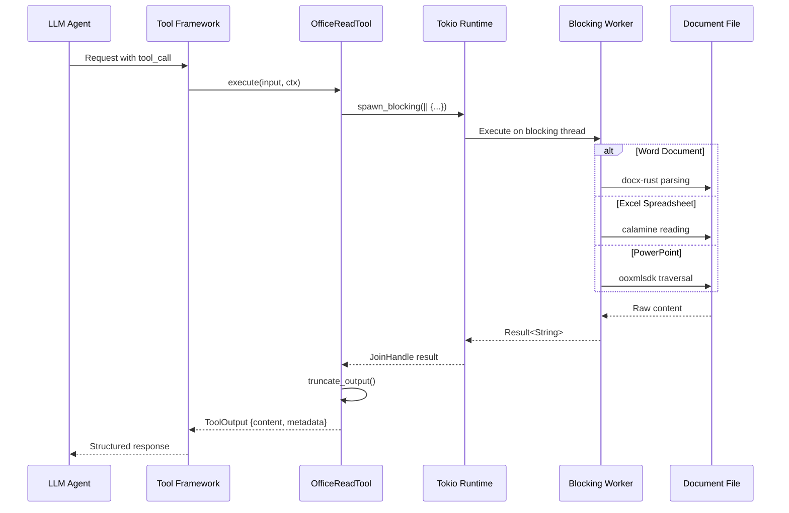

# LLM Tool Design Patterns

### From: office_read

LLM tool design patterns encompass architectural approaches for extending large language model capabilities through structured, executable functions that agents can invoke to interact with external systems, access data, or perform computations. The office_read.rs implementation exemplifies several critical patterns in this emerging domain: the Tool trait abstraction for standardized capability exposure, JSON Schema-based parameter definition enabling automatic interface generation, permission categorization for security governance, and async execution with blocking operation offloading. These patterns address fundamental challenges in bridging LLM reasoning with practical system interactions.

The `Tool` trait implementation demonstrates interface design for LLM consumption, with `name` and `description` providing natural language identification, `parameters_schema` offering machine-readable parameter contracts through JSON Schema, and `execute` handling invocation with structured input/output. This design enables dynamic tool discovery and invocation by agent frameworks—LLMs can reason about available tools based on descriptions, validate arguments against schemas, and interpret results. The pattern separates capability definition from execution, allowing tools to be composed into agent systems without hardcoded integration. The "file:read" permission category implements capability-based security, ensuring document access requires explicit authorization.

Async execution with `tokio::task::spawn_blocking` illustrates performance considerations in LLM tool design. Document parsing is CPU-intensive and potentially blocking; executing synchronously would stall the async runtime serving multiple concurrent agent requests. The spawn_blocking pattern isolates synchronous work while maintaining async interface compatibility. Output truncation addresses LLM-specific constraints—context windows limit input length, necessitating strategies for handling oversized documents. These patterns reflect broader lessons in LLM system architecture: tools must be secure by default, performant under concurrent load, and designed for graceful degradation when inputs exceed processing limits. The field continues evolving with patterns for streaming responses, multi-modal tools, and compositional tool chains.

## Diagram

## External Resources

- [OpenAI function calling documentation for LLM tools](https://platform.openai.com/docs/guides/function-calling) - OpenAI function calling documentation for LLM tools
- [JSON Schema specification for structured data validation](https://json-schema.org/) - JSON Schema specification for structured data validation
- [Tokio documentation on bridging sync and async code](https://tokio.rs/tokio/topics/bridging) - Tokio documentation on bridging sync and async code

## Sources

- [office_read](../sources/office-read.md)
