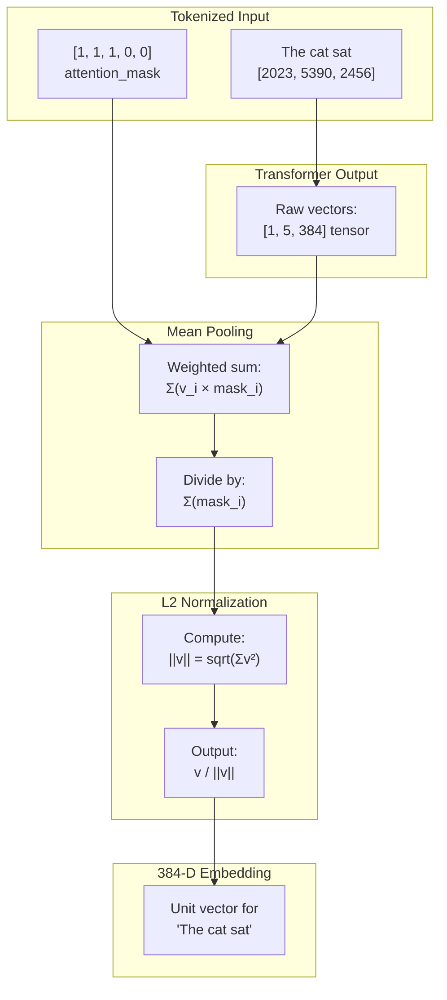

# Mean Pooling with Attention Masking

### From: local

Mean pooling is a technique for converting variable-length sequence outputs from transformer models into fixed-length vector representations suitable for similarity comparisons and information retrieval. Unlike using only the [CLS] token or max pooling approaches, mean pooling averages all token representations in the sequence, producing a more comprehensive semantic summary that incorporates information from the entire input. The implementation in LocalEmbeddingProvider extends basic mean pooling with attention mask weighting, where padding tokens (added to standardize sequence lengths) are excluded from the average by multiplying their contributions by zero in the attention mask. This ensures that the final embedding reflects only meaningful content rather than being diluted by padding artifacts.

The mathematical implementation proceeds through several careful steps. First, the raw transformer outputs of shape `[batch_size, sequence_length, hidden_dim]` are extracted from the ONNX session. For MiniLM-L6, this produces tensors of shape `[1, seq_len, 384]`. The pooling operation computes a weighted sum across the sequence dimension (dimension 1), using the attention mask values as weights. The code iterates through each position in the sequence, accumulating `output[0, s, d] * mask[s]` for each dimension `d`, while simultaneously tracking the sum of mask values as a normalizing denominator. After accumulation, each dimension is divided by the total mask weight to produce the mean. This weighted approach is crucial because transformer models process all inputs to a fixed maximum length, and without masking, padded positions would contribute meaningless zeros that skew the semantic representation.

Following mean pooling, L2 normalization (also called unit vector normalization) is applied to ensure all embeddings have unit length. This step is essential for cosine similarity calculations, as it makes the dot product between any two embeddings equivalent to their cosine similarity. The normalization computes the Euclidean norm `sqrt(sum(v_i^2))` and divides each component by this value. The implementation handles edge cases where the norm might be zero (degenerate inputs) by checking before division. Together, these operations produce embeddings where geometric relationships in vector space directly correspond to semantic relationships in text space, enabling reliable nearest-neighbor search and semantic clustering operations that power the ragent memory system.

## Diagram

## External Resources

- [Sentence-BERT documentation on computing sentence embeddings with pooling strategies](https://www.sbert.net/examples/applications/computing-embeddings/README.html) - Sentence-BERT documentation on computing sentence embeddings with pooling strategies
- [Sentence-BERT paper: Sentence Embeddings using Siamese BERT-Networks](https://arxiv.org/abs/1908.10084) - Sentence-BERT paper: Sentence Embeddings using Siamese BERT-Networks

## Related

- [Cosine Similarity](cosine-similarity.md)

## Sources

- [local](../sources/local.md)
