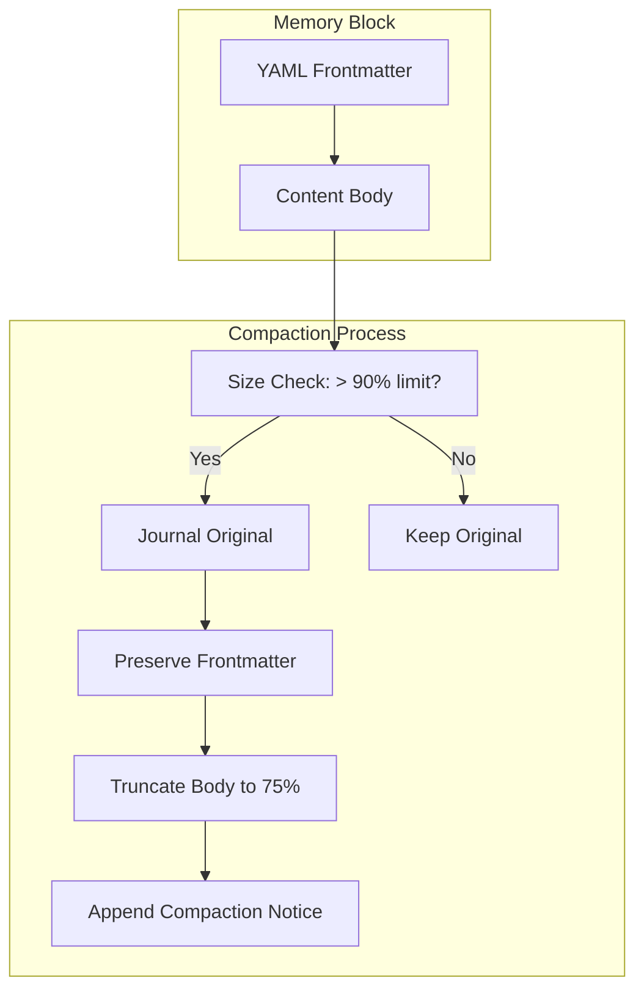

# Memory Block Compaction

### From: compact

Memory block compaction addresses the practical constraint that persistent storage for AI agent context windows cannot grow indefinitely without impacting retrieval performance and storage costs. The ragent system implements a sophisticated compaction strategy that respects document structure through YAML frontmatter preservation while applying intelligent truncation to body content. This approach recognizes that frontmatter typically contains essential metadata—categories, tags, confidence scores, and provenance information—whose loss would fundamentally degrade memory utility, whereas body content often contains elaborative detail amenable to summarization. The 90% threshold for triggering compaction and 75% target size provide headroom that prevents thrashing from frequent minor compactions while achieving meaningful space reduction.

The journaling integration represents a critical reliability feature that distinguishes production-grade compaction from naive truncation. By logging complete original content with unique identifiers before any modification, the system maintains an immutable audit trail supporting forensic analysis, compliance requirements, and disaster recovery. The appended compaction notice within truncated blocks informs downstream consumers of data provenance, preventing silent semantic drift from partial content. This transparency principle aligns with emerging standards for AI system observability and explainability, where understanding what information was available to decision-making processes becomes essential for debugging and trust establishment. The block scope abstraction (Project vs Global) further enables contextual compaction policies where different size limits or retention rules might apply to universal versus specific knowledge.

## Diagram

## External Resources

- [General principles of data compaction and archival strategies](https://en.wikipedia.org/wiki/Data_compaction) - General principles of data compaction and archival strategies
- [YAML specification for understanding frontmatter syntax](https://yaml.org/spec/) - YAML specification for understanding frontmatter syntax

## Sources

- [compact](../sources/compact.md)
