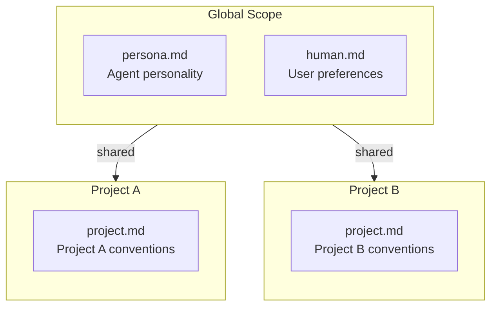

# Memory Block Scoping

### From: defaults

Memory block scoping establishes a hierarchical organization principle for AI agent memory, distinguishing between global persistence across all projects and localized context within specific workspaces. The `BlockScope` enumeration defines this binary taxonomy with `Project` and `Global` variants, enabling the memory system to serve dual purposes: maintaining consistent agent behavior and user preferences across diverse contexts while adapting to project-specific conventions and requirements. This scoping mechanism reflects a nuanced understanding of how contextual information should flow through AI-assisted development workflows.

The global scope addresses information with universal applicability regardless of current working directory—fundamental aspects of agent personality, enduring user preferences, and stable working relationship patterns. When a developer switches between a Rust systems project and a Python data science repository, their preference for detailed explanations versus concise code remains relevant. Similarly, the agent's self-concept as a helpful coding assistant with particular communication values shouldn't require redefinition per project. Global memory creates continuity and reduces repetitive configuration, treating certain aspects of the human-AI relationship as persistent identity rather than contextual state.

The project scope, conversely, captures information whose relevance is bound to specific codebases and their particular ecosystems. Framework conventions, architectural patterns, team-specific practices, and domain terminology vary dramatically between projects. A memory block documenting that this repository uses a particular RPC framework or follows specific error handling conventions provides targeted assistance that would be inappropriate to apply globally. The implementation enforces this separation through distinct storage paths, with `seed_defaults` explicitly iterating scope-specific default collections and passing appropriate scope parameters to storage operations. This architectural decision enables sophisticated multi-project workflows where agents can simultaneously maintain consistent identity and adapt deeply to local context.

## Diagram

## External Resources

- [Twelve-Factor App methodology on configuration and environment-specific settings](https://12factor.net/config) - Twelve-Factor App methodology on configuration and environment-specific settings

## Related

- [Idempotent Initialization](idempotent-initialization.md)

## Sources

- [defaults](../sources/defaults.md)
