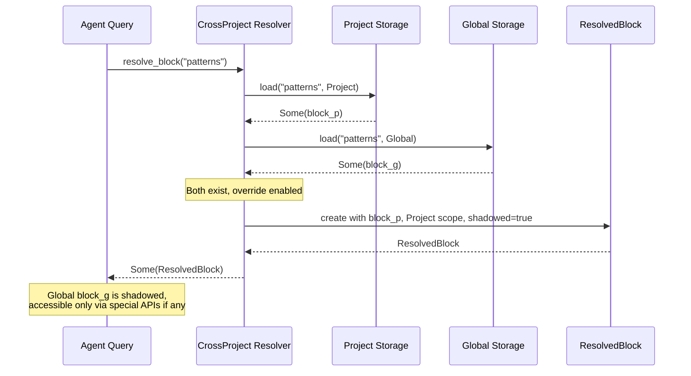

# Memory Block Shadowing

### From: cross_project

Memory block shadowing is a namespace management concept where a definition in a more specific scope prevents access to a definition with the same name in a more general scope. In Ragent's cross-project system, shadowing occurs when a project-scoped memory block has the same label as a global-scoped block and `project_override` is enabled. Unlike simple overwriting, shadowing preserves the existence of the global block while making it inaccessible through normal resolution paths—much like how a local variable shadows a global variable in programming languages. The `ResolvedBlock` type's `shadowed` boolean field explicitly tracks when this phenomenon occurs, providing important metadata for debugging, auditing, and potential "unshadowing" operations in future features.

The concept of shadowing carries significant implications for knowledge management in agent systems. When a project shadows a global pattern with a customized version, it documents an intentional deviation from organizational standards. This creates opportunities for tooling to detect and highlight such deviations, perhaps suggesting synchronization or flagging them for code review. The shadowing mechanism also supports safe experimentation: teams can fork global knowledge, iterate locally, and later contribute improvements back upstream. The implementation's careful tracking of shadowing states—distinguishing between "project won without competition" and "project won by shadowing"—preserves information that simpler designs would lose. This semantic precision reflects the broader principle that agent memory systems should be introspectable, allowing both humans and other agents to understand not just what knowledge is active, but how it came to be selected.

## Diagram

## External Resources

- [Shadowing in programming language theory](https://en.wikipedia.org/wiki/Shadow_(programming)) - Shadowing in programming language theory

## Related

- [Cross-Project Memory Scope Resolution](cross-project-memory-scope-resolution.md)
- [Configuration-Driven Feature Flags](configuration-driven-feature-flags.md)

## Sources

- [cross_project](../sources/cross-project.md)
