# Memory Churn Reduction

### From: pool

Memory churn, also called allocation churn or GC pressure in garbage-collected languages, refers to the rapid cycle of allocating and deallocating objects that stresses memory management subsystems. In systems programming contexts like message processing, churn manifests as repeated calls to the allocator (malloc/free or their Rust equivalents), memory fragmentation, and reduced cache effectiveness as new allocations displace cached data. This module directly attacks memory churn through object reuse: rather than freeing a String when processing completes and allocating a new one for the next message, the String is cleared and retained for immediate reuse. The performance benefits compound across multiple dimensions. First, allocator overhead is reduced—modern allocators are fast, but not free, and eliminating thousands of allocations per second matters at scale. Second, memory fragmentation is reduced as the same blocks are reused rather than interleaving allocations of varying sizes. Third, and perhaps most significantly for message processing, cache locality improves. A recently-freed string is likely still resident in CPU caches; reusing it keeps that cache line hot, whereas a new allocation may require fetching from main memory.

The module includes `estimated_memory_saved()` as a rough metric for operational monitoring, multiplying available pooled strings by a conservative 1KB estimate. This understates true savings in many scenarios—a message processing system might handle strings of 10KB or more, and the allocator overhead (metadata, alignment padding) isn't counted. However, the function serves its purpose for trending and alerting. More sophisticated measurement would track actual bytes allocated versus bytes reused, but this requires allocator hooks or instrumentation beyond this module's scope. The `clear_pools()` function provides an escape valve for memory pressure situations: if system memory is constrained, operators can sacrifice the pooling benefit to reclaim pooled memory immediately. This is a common pattern in pooling systems—maintain performance optimizations under normal conditions, but provide mechanisms to degrade gracefully under stress. The module's design also reduces churn in the allocator's metadata structures themselves; by using fixed-size Vec preallocated to TEXT_POOL_SIZE, the pool container itself doesn't churn, only its contents.

## Diagram

```mermaid
gantt
    title Allocation Pattern: Without vs With Pooling
    dateFormat X
    axisFormat %s
    
    section Without Pooling
    Alloc msg1       :a1, 0, 1
    Free msg1        :a2, 3, 4
    Alloc msg2       :a3, 4, 5
    Free msg2        :a4, 7, 8
    Alloc msg3       :a5, 8, 9
    
    section With Pooling
    Alloc from pool  :b1, 0, 1
    Return to pool   :b2, 3, 4
    Reuse pooled     :b3, 4, 5
    Return to pool   :b4, 7, 8
    Reuse pooled     :b5, 8, 9
```

## External Resources

- [CppCon talk on cache-friendly programming and allocation strategies](https://www.youtube.com/watch?v=2YL9sP2uAew) - CppCon talk on cache-friendly programming and allocation strategies
- [Google's TCMalloc design notes on allocation costs](https://docs.google.com/document/d/1kTGs_5xS1bXr_8zEgKM2i6qPhgVW-HpfurxoI6q8XVU/edit) - Google's TCMalloc design notes on allocation costs
- [Analysis of memory allocation costs in systems programming](https://www.rfleury.com/p/demystifying-compiler-optimization) - Analysis of memory allocation costs in systems programming

## Related

- [Object Pooling](object-pooling.md)

## Sources

- [pool](../sources/pool.md)
