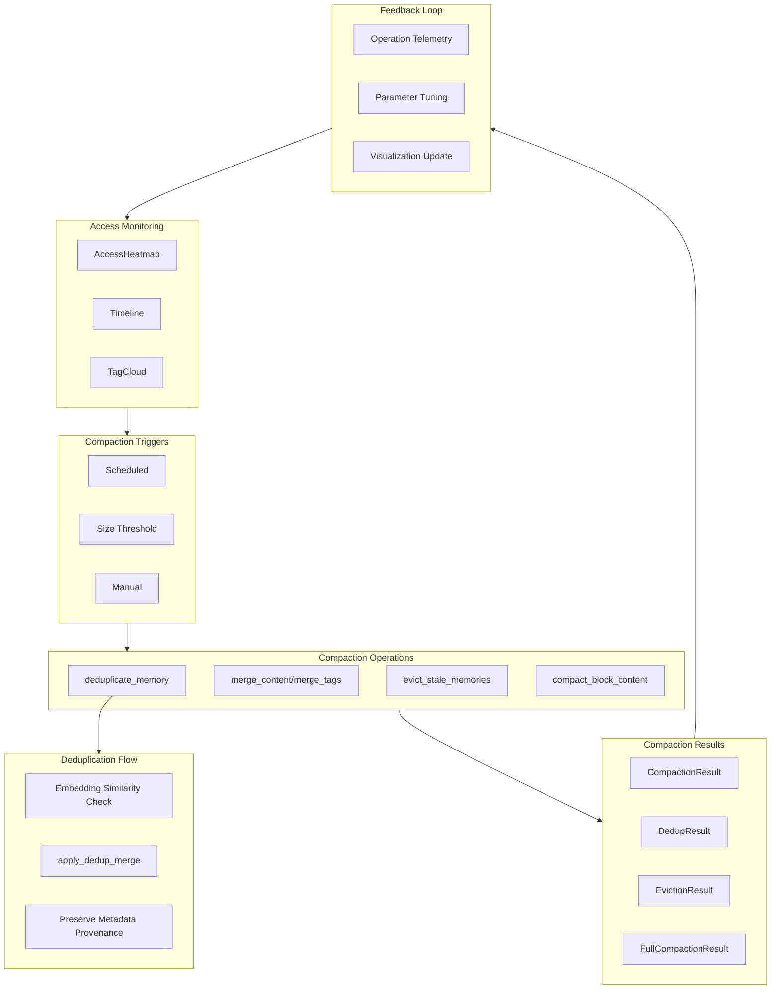

# Memory Compaction and Maintenance

### From: mod

Memory compaction and maintenance constitute essential operational processes for sustainable long-term agent memory systems, addressing the fundamental challenge that unbounded accumulation leads to degraded performance and quality. As agents interact over extended periods, they generate memories at rates that would quickly overwhelm naive storage systems. Without active maintenance, memory stores accumulate redundancy through repeated similar observations, stale information that no longer reflects current realities, and noise from low-quality extractions. Compaction strategies implement systematic processes to optimize memory stores, balancing retention of valuable knowledge against elimination of harmful redundancy and obsolete content.

The ragent compaction subsystem provides multiple complementary mechanisms through the `compact` module. Deduplication (`deduplicate_memory`, `apply_dedup_merge`) identifies and merges content-equivalent memories, preserving unique information while eliminating exact or near-exact duplicates. This process requires careful handling of metadata like access timestamps and confidence scores to maintain accurate provenance. Content merging (`merge_content`, `merge_tags`) combines related memories into unified representations, creating more comprehensive and coherent knowledge than fragmented individual entries. Stale memory eviction (`evict_stale_memories`) removes content that has not been accessed within configured timeframes, based on the observation that unused information in rapidly evolving domains like software development often becomes misleading rather than merely obsolete.

Full compaction (`run_compaction`, `compact_blocks`) orchestrates these operations with configurable triggers (`CompactionTrigger`), enabling both scheduled maintenance and threshold-based execution. The `CompactionResult`, `DedupResult`, `EvictionResult`, and `FullCompactionResult` types provide detailed telemetry on maintenance operations, supporting monitoring and tuning of compaction parameters. This observability is crucial because aggressive compaction risks knowledge loss while conservative approaches permit bloat. The `compact_block_content` function applies these strategies at the individual block level, enabling granular control over memory domain maintenance. The results populate visualizations like `AccessHeatmap`, which inform compaction decisions by revealing access patterns that distinguish actively-used knowledge from dormant archival content.

The theoretical foundations of memory compaction draw from database maintenance (vacuuming, reindexing), cache eviction policies (LRU, LFU), and cognitive science's understanding of forgetting as adaptive rather than purely degenerative. Effective compaction must be semantics-aware, recognizing that superficially different expressions may convey identical meaning worth deduplication, while similar-sounding statements in different contexts may require distinct preservation. The ragent implementation's integration with embedding-based similarity provides this semantic awareness, enabling intelligent merge decisions beyond syntactic comparison. Maintenance scheduling balances immediacy (compacting when thresholds are exceeded) against amortization (spreading costs across low-activity periods), with trigger configurations allowing deployment-specific tuning based on storage constraints, latency requirements, and knowledge freshness needs.

## Diagram

## External Resources

- [Cache eviction algorithms relevant to memory maintenance](https://en.wikipedia.org/wiki/Cache_replacement_policies) - Cache eviction algorithms relevant to memory maintenance
- [PostgreSQL vacuuming - database compaction analogy](https://www.postgresql.org/docs/current/routine-vacuuming.html) - PostgreSQL vacuuming - database compaction analogy
- [Research on knowledge editing and maintenance in neural networks](https://arxiv.org/abs/2203.07618) - Research on knowledge editing and maintenance in neural networks

## Sources

- [mod](../sources/mod.md)
