# Metadata Standardization

### From: metadata

Metadata standardization is the practice of establishing consistent schemas, field names, and value types for auxiliary data describing primary content or operations. In the RAgent Core framework, this concept is embodied by the `MetadataBuilder`'s predefined methods that enforce canonical field names like `line_count` versus `lineCount` or `LineCount`, `duration_ms` with explicit millisecond units versus ambiguous `duration`, and boolean flags with clear semantics like `summarized` versus generic `truncated`. This standardization solves critical interoperability problems in heterogeneous systems where multiple tools, developed by different authors or at different times, must produce consumable output that downstream components can interpret without tool-specific parsing logic.

The module's approach to standardization extends beyond naming conventions to semantic conventions that encode domain knowledge. The pairing of `line_count` with `total_lines` establishes a pattern for truncated content where the actual returned lines and original total are both available. The `exit_code` field's use of signed `i32` accommodates negative values used by some shells for signal termination, while `status_code` uses `u16` matching HTTP specifications. The `edit_lines` method's production of both `old_lines` and `new_lines` fields encodes the semantics of file editing operations in the metadata structure itself. These conventions, enforced through the type system and method signatures, prevent the ambiguity and inconsistency that arise when developers make ad-hoc decisions about metadata representation.

The tension between standardization and flexibility is managed through the `custom` method, which provides an escape hatch for tool-specific metadata while maintaining the structured builder interface. This design acknowledges that no predefined schema can anticipate all future tool requirements, while encouraging developers to extend the standard fields when patterns emerge across multiple tools. The module's comprehensive test coverage for standard fields—verifying type correctness for numeric fields, string encoding for paths, and boolean handling for flags—establishes a contract that the entire RAgent ecosystem can rely upon. In production agent systems, this standardization enables sophisticated behaviors like automatic result summarization based on `truncated` flags, execution retry logic triggered by non-zero `exit_code` values, and progress tracking through `task_id` correlation across distributed tool invocations.

## Diagram

```mermaid
flowchart LR
    subgraph StandardFields["Standardized Metadata Fields"]
        FileOps["File Operations<br/>path, line_count, byte_count, file_count"]
        Execution["Execution Metrics<br/>exit_code, duration_ms, timed_out"]
        Content["Content Processing<br/>summarized, truncated, total_lines"]
        Search["Search & Filter<br/>matches, entries, count"]
        Network["Network Operations<br/>status_code"]
        Editing["Edit Operations<br/>old_lines, new_lines"]
        Task["Task Management<br/>task_id"]
    end
    
    subgraph Consumers["Metadata Consumers"]
        Logging["Structured Logging"]
        Monitoring["Execution Monitoring"]
        Analytics["Result Analytics"]
        Agents["Agent Decision Logic"]
    end
    
    StandardFields --> Consumers
    
    style StandardFields fill:#e1f5fe
    style Consumers fill:#f3e5f5
```

## External Resources

- [JSON Schema specification for structured data validation](https://json-schema.org/) - JSON Schema specification for structured data validation
- [W3C Metadata Standards for Tabular Data](https://www.w3.org/TR/tabular-metadata/) - W3C Metadata Standards for Tabular Data

## Sources

- [metadata](../sources/metadata.md)
