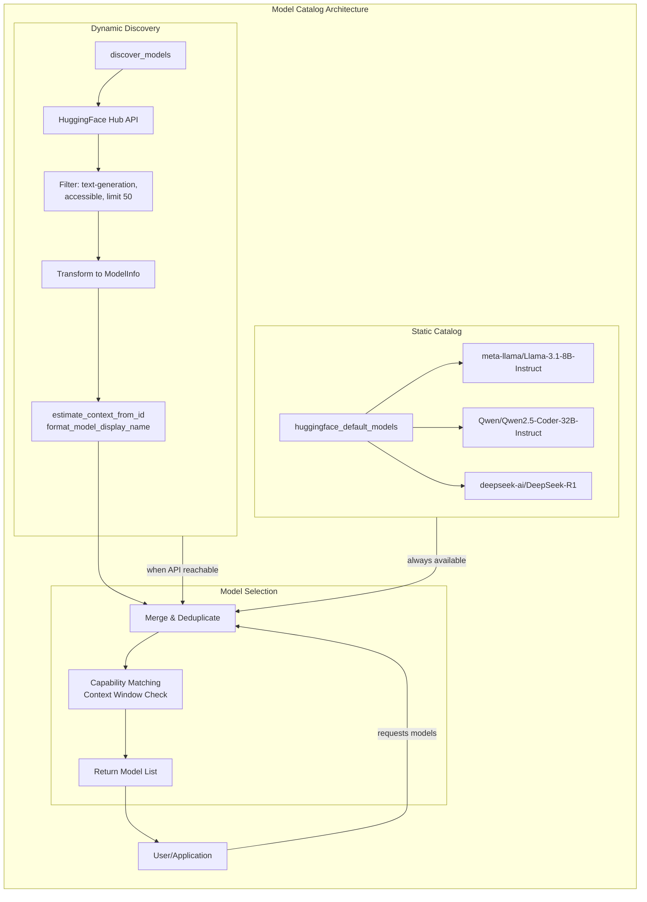

# Model Discovery and Catalog Curation

### From: huggingface

Model discovery and catalog curation addresses the challenge of presenting appropriate model options to users while balancing completeness, quality, and API limitations. The HuggingFace implementation provides two complementary approaches: a static default catalog (huggingface_default_models) and dynamic discovery via the HuggingFace Hub API (discover_models). This dual strategy ensures reliability—static defaults work offline or during API outages—while enabling access to the full breadth of available models when connectivity permits. The design reflects production considerations for AI applications where model availability directly impacts functionality.

The static catalog implements careful curation, selecting models that represent diverse capabilities and use cases while ensuring they function well through the Inference API. The current selection includes Llama 3.1 8B and 70B variants for general instruction following, Qwen 2.5 Coder 32B for code generation, Qwen 2.5 72B for larger-scale tasks, and DeepSeek R1 for reasoning-intensive applications. Each entry includes rich metadata: cost structure (all free for this tier), capability flags (reasoning, streaming, vision, tool_use), and context window sizes. Notably, the DeepSeek R1 configuration differs from others by enabling reasoning while disabling tool_use, accurately reflecting the model's training and strengths. This metadata enables intelligent model selection within ragent's higher layers.

Dynamic discovery queries the HuggingFace Hub API to find text-generation models available through the Inference API, filtering for accessible, non-gated models and limiting results to MAX_DISCOVERED_MODELS (50) to prevent overwhelming users. The discover_models function handles API authentication, response parsing via HfModelEntry structures, and transformation into ragent's ModelInfo format. Helper functions extract display names from model IDs (format_model_display_name) and estimate context windows from model naming conventions (estimate_context_from_id), addressing the reality that Hub API metadata doesn't always include these essential parameters. This estimation heuristic—checking for patterns like "32k", "128k", "8B", "70B" in model IDs—demonstrates practical API integration where ideal data isn't available and intelligent inference fills gaps.

The combination of static and dynamic approaches enables graceful degradation: if discovery fails, the curated defaults remain available. This pattern appears across AI infrastructure—OpenAI's model listing endpoint, Anthropic's model cards, Google's model catalog—where the tension between API-provided metadata and application-specific needs requires thoughtful abstraction. The implementation's careful attention to cost (all zero for free tier), capabilities (accurate feature flags), and context windows (essential for prompt engineering) demonstrates how model catalog management directly impacts application correctness and user experience.

## Diagram

## External Resources

- [HuggingFace Hub API documentation for model discovery](https://huggingface.co/docs/hub/api) - HuggingFace Hub API documentation for model discovery
- [HuggingFace model repository browser](https://huggingface.co/models) - HuggingFace model repository browser

## Sources

- [huggingface](../sources/huggingface.md)
