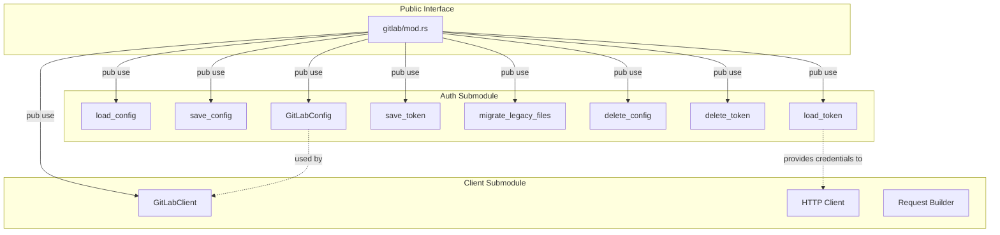

# Modular API Client Architecture

### From: mod

Modular API client architecture is a software design pattern that decomposes client functionality into discrete, cohesive submodules with well-defined responsibilities and minimal coupling between components. This architectural approach promotes maintainability by isolating concerns—for example, separating authentication logic from transport layer operations and business-specific API methods—allowing each module to evolve independently as requirements change. In the ragent GitLab module, this pattern manifests through the division into `auth` and `client` submodules, where `auth` handles all credential lifecycle operations (loading, saving, migrating, deleting) while `client` presumably manages HTTP communication and API-specific request building. This separation enables developers to understand and modify authentication mechanisms without risking regression in API call functionality, and vice versa. Modular architecture also facilitates testing through the ability to mock or stub individual components, and supports code reuse when similar authentication patterns need to be applied to different API clients within the same codebase. The explicit re-exports in the module root (`pub use`) demonstrate thoughtful API design, creating a clean public interface that hides internal module structure while maintaining implementation flexibility.

## Diagram

## External Resources

- [Rust module system documentation](https://rust-book.cs.brown.edu/ch07-02-defining-modules-to-control-scope-and-privacy.html) - Rust module system documentation
- [Rust documentation best practices](https://doc.rust-lang.org/rustdoc/how-to-write-documentation.html) - Rust documentation best practices

## Sources

- [mod](../sources/mod.md)
