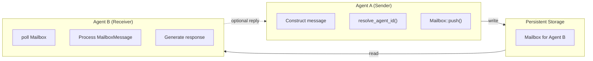

# Multi-Agent Communication Patterns

### From: team_message

Multi-agent communication patterns describe the architectural approaches enabling autonomous software agents to exchange information, coordinate actions, and collectively solve problems. The `TeamMessageTool` implementation exemplifies the direct messaging pattern, where agents communicate through point-to-point channels rather than broadcast or publish-subscribe mechanisms. This approach offers predictability in message delivery, clear sender-receiver relationships, and natural support for request-response interactions, though it may limit flexibility compared to more decoupled architectures.

The code reveals several important considerations in multi-agent system design. Message persistence through the `Mailbox` abstraction ensures that communication survives agent restarts and enables asynchronous interaction patterns where recipients need not be active at send time. The strong typing of messages through `MailboxMessage` with its `MessageType` enumeration suggests an extensible protocol capable of supporting different communication semantics—simple messages, task assignments, queries, or responses—within a unified framework. This protocol layering enables evolution of the communication system without breaking existing agent implementations.

Identity management in multi-agent systems, shown here through agent ID resolution, presents significant design challenges. The system's use of both human-readable names and canonical identifiers ("tm-" prefixed strings) addresses the tension between usability and system reliability. Human operators and agent developers benefit from meaningful names, while the system requires stable, unique identifiers for correct routing and audit logging. The resolution layer that maps between these representations must handle edge cases like name collisions, renaming operations, and cross-team references. The "lead" special case indicates recognition of hierarchical team structures where certain agents hold privileged roles, requiring corresponding special handling in communication protocols.

The integration of messaging with a tool framework suggests a command-oriented architecture where communication is one capability among many that agents possess. Rather than building messaging as a core runtime service, it's exposed as an invocable tool, allowing for permission-based access control, usage logging, and potentially dynamic capability discovery. This approach aligns with modern agent architectures that emphasize composability and least-privilege security, where agents only access capabilities explicitly granted to them.

## Diagram

## External Resources

- [Multi-agent systems overview from ScienceDirect](https://www.sciencedirect.com/topics/computer-science/multi-agent-system) - Multi-agent systems overview from ScienceDirect
- [Academic survey on multi-agent system architectures](https://www.researchgate.net/publication/220995798_Multi-Agent_Systems) - Academic survey on multi-agent system architectures
- [Actor model of concurrent computation](https://en.wikipedia.org/wiki/Actor_model) - Actor model of concurrent computation

## Sources

- [team_message](../sources/team-message.md)
