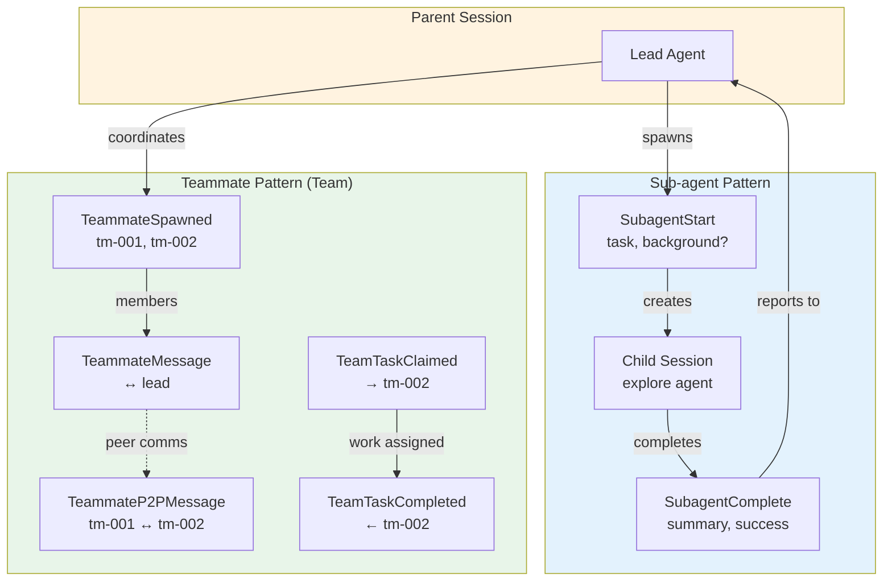

# Multi-Agent Coordination

### From: mod

Multi-agent coordination in ragent-core is implemented through a sophisticated event taxonomy that supports both hierarchical delegation and peer-to-peer collaboration patterns. The event system recognizes that modern agent systems rarely involve monolithic single agents, instead comprising dynamic constellations of specialized agents that cooperate on complex tasks. The module explicitly addresses this through two complementary subsystems: the sub-agent lifecycle (SubagentStart, SubagentComplete, SubagentCancelled) for hierarchical task delegation, and the teammate lifecycle (TeammateSpawned, TeammateMessage, TeammateIdle, etc.) for peer coordination within teams.

The sub-agent pattern enables a parent agent to spawn child agents with specific tasks, optionally running them in background (non-blocking) or foreground (blocking) modes. The SubagentStart event captures the delegation contract: parent session ID, unique task ID, child session ID for the spawned agent, the agent specialization (e.g., "explore"), and the task prompt. The background field is particularly significant—it determines whether the parent continues autonomously or awaits results. This supports patterns like exploratory research where a research sub-agent works in parallel while the coordinator continues planning. SubagentComplete delivers results including success status, summary, and duration, enabling the parent to integrate outputs or handle failures. SubagentCancelled supports graceful degradation when user intervention or timeout terminates background tasks.

The teammate pattern implements more symmetric collaboration through named teams with a lead session and multiple member sessions. TeammateSpawned establishes membership with human-friendly names and agent IDs. Communication occurs through TeammateMessage (lead-involved) and TeammateP2PMessage (peer-to-peer, explicitly noted as neither sender nor recipient being "lead"), with the architecture distinguishing these so the lead maintains observability without being communication bottleneck. TeammateIdle and TeammateFailed provide liveness and failure detection. TeamTaskClaimed and TeamTaskCompleted implement work distribution through a shared task list pattern, with claim semantics preventing duplicate work.

The event design reveals careful attention to coordination challenges: session_id consistently identifies the coordinating context (lead session for team events, parent for sub-agent), while child_session_id or agent_id identifies specific participants. The preview field in message events limits payload size for UI responsiveness while indicating content presence. The distinction between TeammateMessage and TeammateP2PMessage shows awareness of communication topology impacts on system observability and debugging. These patterns collectively enable ragent to scale from single-agent sessions to complex multi-agent workflows without architectural redesign.

## Diagram

## External Resources

- [Multi-agent systems - Wikipedia](https://en.wikipedia.org/wiki/Multi-agent_system) - Multi-agent systems - Wikipedia
- [Actor model of computation overview](https://www.actor-model.com/) - Actor model of computation overview

## Related

- [Event-Driven Architecture](event-driven-architecture.md)

## Sources

- [mod](../sources/mod.md)
