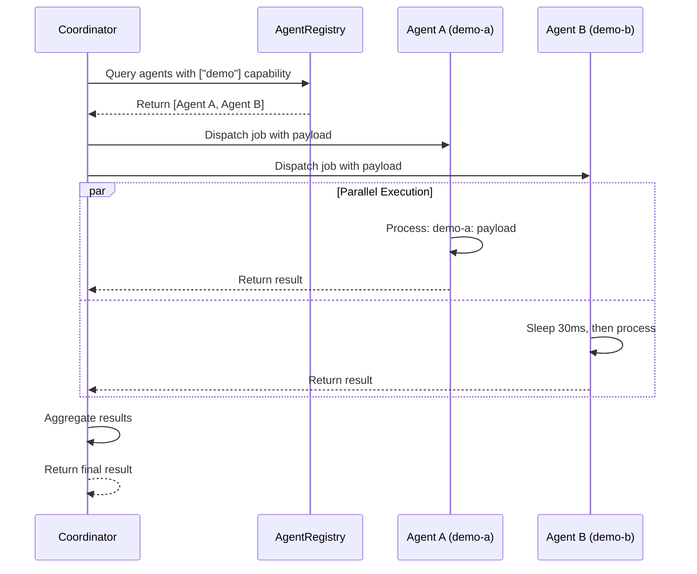

# Multi-Agent Orchestration

### From: main

Multi-agent orchestration in ragent refers to the architectural pattern enabling coordinated execution across multiple specialized AI agents, implemented through the Coordinator and AgentRegistry types in ragent_core::orchestrator. This concept moves beyond single-agent interaction to support distributed problem-solving where agents with different capabilities collaborate on complex tasks. The orchestration example in the source demonstrates capability-based routing: jobs specify required capabilities (e.g., ["demo"]) and the coordinator matches them to registered agents advertising those capabilities.

The implementation shows sophisticated async patterns: responders are Arc-wrapped async closures (using futures::future::FutureExt for boxing) that can execute concurrently, with the coordinator aggregating results. The AgentRegistry maintains the capability-to-agent mapping, supporting dynamic registration and deregistration. The JobDescriptor encapsulates work requests with unique IDs, capability requirements, and payload data. The start_job_sync method suggests both synchronous-wait and potentially async-callback execution modes, though the example shows blocking synchronization on completion.

This architecture enables scenarios like parallel research across multiple specialized agents (code analysis, documentation search, test generation), fault-tolerant execution with agent failover, and load balancing across agent pools. The responder pattern abstracts agent communication, allowing agents to run in-process, as separate threads, or potentially as remote services. The coordinator's ownership of the registry enables centralized policy enforcement for rate limiting, priority queuing, and resource allocation across the agent pool.

## Diagram

## External Resources

- [Multi-agent systems on Wikipedia](https://en.wikipedia.org/wiki/Multi-agent_system) - Multi-agent systems on Wikipedia
- [Microsoft Research on hierarchical autonomous agents](https://www.microsoft.com/en-us/research/publication/autoagents-a-hierarchy-for-autonomous-generative-agents/) - Microsoft Research on hierarchical autonomous agents

## Sources

- [main](../sources/main.md)

### From: team_spawn

Multi-agent orchestration represents the foundational architectural pattern underlying `TeamSpawnTool`, wherein multiple specialized AI agents collaborate under coordinated leadership to accomplish complex objectives. This paradigm departs from monolithic agent designs by decomposing work into bounded, delegable units assigned to purpose-specific teammates that execute in parallel. The `TeamSpawnTool` implementation embodies orchestration principles through explicit lifecycle management: spawning with context propagation, synchronization via `team_wait` (explicitly distinguished from generic `wait_tasks`), and result aggregation. The architecture recognizes that effective collaboration requires not merely process creation but careful attention to context boundaries, communication patterns, and synchronization semantics.

The implementation reveals sophisticated understanding of distributed systems challenges in agent collaboration. The "one work item per spawn" rule encoded in both documentation and `detect_multi_item_list` validation addresses fundamental constraints of context window limitations and attention fragmentation—phenomena well-documented in large language model behavior where excessive scope degrades performance. The explicit warning against using `wait_tasks` for teammates indicates semantic distinctions between generic task waiting and team-specific synchronization, likely reflecting different underlying primitives for process-level versus agent-level coordination. These distinctions suggest the framework designers anticipate complex topologies including nested teams, heterogeneous agent types, and potentially cross-session persistence requirements.

Orchestration in this context extends beyond technical process management to encompass user experience and trust considerations. The permission-based override system for multi-item prompts demonstrates recognition that automated enforcement of best practices must balance efficiency with user autonomy—sometimes users intentionally want multi-item delegation, and the system accommodates this through explicit consent rather than prohibition. This pattern of "opinionated defaults with escape hatches" characterizes mature orchestration frameworks that must serve both novice users (protected from mistakes) and advanced users (empowered to break rules intentionally). The comprehensive metadata tracking throughout—agent IDs, model provenance, task assignments, status states—enables auditability and debugging essential for production multi-agent deployments.

### From: config

Multi-agent orchestration is the discipline of coordinating multiple autonomous AI agents to accomplish complex tasks that exceed the capabilities of any single agent. The ragent configuration system embodies this concept through its hierarchical team structure, where a lead agent manages specialized teammates with distinct roles and capabilities. This approach mirrors organizational patterns from human team management, applying them to software systems where agents can be spawned, assigned tasks, monitored for health, and gracefully shut down based on workflow requirements.

The orchestration challenge involves managing concurrent execution, resource allocation, and inter-agent communication while maintaining system stability. Ragent addresses this through state machine-based lifecycle management, where each agent transitions through well-defined states (spawning, working, idle, blocked, shutting down, stopped, failed). These states enable the orchestrator to make informed decisions about task distribution, detect failures, and implement recovery strategies. The `max_teammates` setting provides backpressure against resource exhaustion, while `auto_claim_tasks` enables efficient work distribution without central coordination bottlenecks.

Quality-gate hooks represent an extension point for integrating orchestration with external systems, allowing custom validation, notification, or deployment automation at key lifecycle events. This extensibility is essential for production deployments where agent teams must integrate with existing CI/CD pipelines, monitoring systems, and compliance frameworks. The orchestration model also supports human-in-the-loop workflows through `require_plan_approval`, where agent-generated plans undergo human review before execution—critical for high-stakes applications like security-sensitive code changes.
