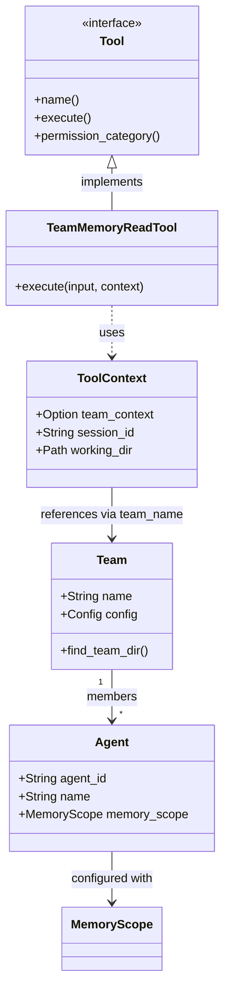

# Multi-Agent Team Architecture

### From: team_memory_read

Multi-agent team architecture describes software design patterns that coordinate multiple AI agents toward common objectives while maintaining clear identity, permission, and communication boundaries. This concept moves beyond single-agent systems to enable complex workflows where specialized agents collaborate, delegate, and share information through structured interfaces. The team abstraction in this codebase encapsulates membership registries, shared configuration, and collective resources like project-scoped memory that enable emergent collaborative behaviors.

The architecture implements hierarchical identity resolution where agents belong to teams, teams have configurations stored in TeamStore, and tools validate membership before permitting access to team resources. This design enables dynamic team composition where agents can participate in multiple teams with potentially different roles and permissions, and where team membership determines available capabilities. The `team:communicate` permission category explicitly categorizes this tool as part of the communication infrastructure that binds agents together.

Production multi-agent systems face distinctive challenges including agent discovery, message routing, conflict resolution when agents disagree, and fair resource allocation among competing agents. The filesystem-based team configuration approach here prioritizes simplicity and auditability over real-time dynamics, suggesting a batch or workflow-oriented deployment pattern rather than continuously running agent collectives. The explicit session identification and agent ID tracking enable correlation of tool invocations across distributed logs, supporting observability requirements for debugging and compliance in regulated environments.

## Diagram

## External Resources

- [Multi-agent systems on Wikipedia](https://en.wikipedia.org/wiki/Multi-agent_system) - Multi-agent systems on Wikipedia
- [Microsoft Research on multi-agent AI systems](https://www.microsoft.com/en-us/research/research-area/artificial-intelligence/?) - Microsoft Research on multi-agent AI systems

## Sources

- [team_memory_read](../sources/team-memory-read.md)
