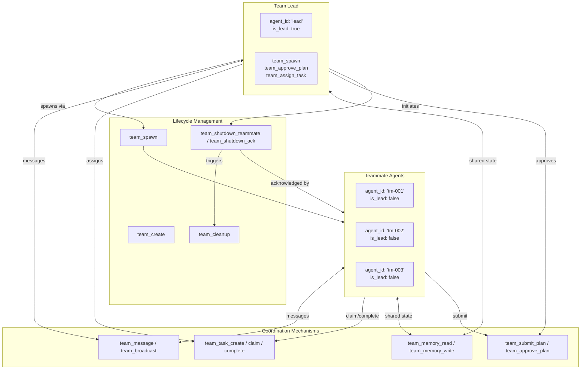

# Multi-Agent Team Coordination

### From: mod

Multi-agent team coordination enables a lead agent to spawn and manage specialized teammate agents, distributing complex tasks across collaborative workers. The ragent-core implementation provides comprehensive infrastructure for this pattern through 17 dedicated team tools covering team lifecycle (create, spawn, cleanup), communication (broadcast, message, read_messages), task management (create, assign, claim, complete), and planning workflows (submit_plan, approve_plan). This represents a sophisticated approach to scaling AI agent capabilities beyond single-threaded execution.

The coordination model uses role-based identity where each session has a TeamContext indicating whether it's the lead or a teammate (identified as `"lead"` or `"tm-NNN"`). The lead maintains authority for spawning teammates and approving plans, while teammates operate semi-autonomously on assigned tasks. Communication occurs through structured messages with team memory providing shared state. The `TeamManagerInterface` abstraction allows different deployment topologies: teammates as threads, processes, or distributed services.

Key design challenges addressed include: preventing resource leaks through `team_cleanup` and shutdown acknowledgment protocols; handling model inheritance where teammates can use the lead's model or specialized alternatives; and ensuring task state consistency across potentially failing agents. The team_spawn tool's parameter design reflects these concerns, accepting team name, teammate name, agent type for specialization, initial prompt, optional model overrides, and working directory. This infrastructure enables patterns like hierarchical task decomposition, parallel execution of independent subtasks, and specialized agent roles (coder, reviewer, planner).

## Diagram

## External Resources

- [Microsoft AutoGen framework for multi-agent conversation](https://microsoft.github.io/autogen/) - Microsoft AutoGen framework for multi-agent conversation
- [CrewAI multi-agent orchestration platform](https://www.crewai.com/) - CrewAI multi-agent orchestration platform
- [LangGraph for building agent workflows](https://langchain-ai.github.io/langgraph/) - LangGraph for building agent workflows

## Sources

- [mod](../sources/mod.md)
