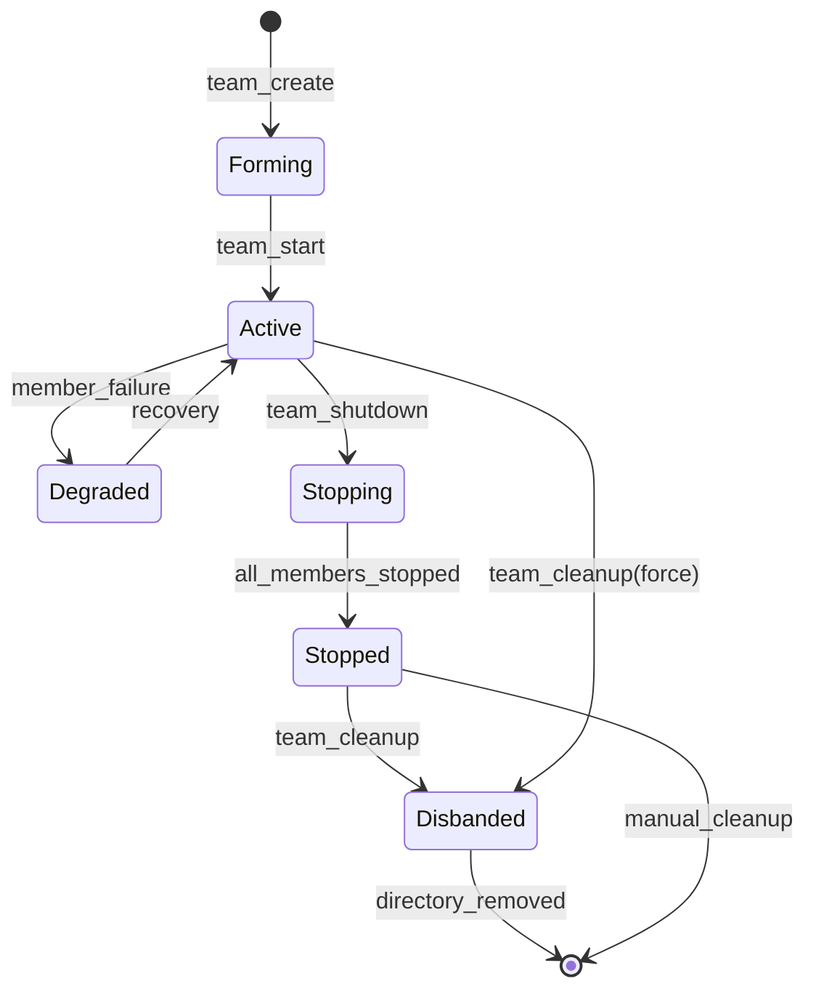

# Multi-Agent Team Lifecycle Management

### From: team_cleanup

Multi-Agent Team Lifecycle Management encompasses the operational processes governing creation, evolution, and termination of collaborative agent collectives in distributed artificial intelligence systems. This concept extends traditional single-agent lifecycle models to address emergent complexities from agent interactions, shared state maintenance, and collective goal pursuit. The TeamCleanupTool implementation reveals specific concerns in the termination phase: ensuring clean shutdown of constituent members, preserving audit trails, and reclaiming persistent resources.

The lifecycle state machine implied by the code distinguishes between operational states (evidenced by MemberStatus variants beyond Stopped) and terminal states (Stopped, Disbanded). This modeling enables graceful degradation patterns where teams can be temporarily suspended rather than destroyed, and destruction itself becomes a two-step process of logical disbandment followed by physical removal. The explicit status field in team configuration, separate from mere directory existence, supports sophisticated orchestration scenarios including team hibernation, migration, and resurrection.

Safety constraints in team cleanup reflect fundamental distributed systems challenges. The prohibition on cleaning teams with active members addresses the split-brain problem variant where external observers might assume team availability while destruction proceeds. By requiring explicit acknowledgment of active member presence—or operator override through force flags—the system prevents accidental termination of in-progress computations. This mirrors patterns in container orchestration systems like Kubernetes, where pod deletion respects grace periods and termination signals.

The metadata capture in successful cleanup operations—recording forced status and active member counts—establishes observability foundations for lifecycle analytics. This audit information enables retrospective analysis of cleanup patterns, identification of teams requiring force termination (potentially indicating operational issues), and capacity planning based on actual team dissolution rates. Such telemetry transforms lifecycle management from purely operational necessity into strategic resource optimization input.

## Diagram

## External Resources

- [Kubernetes pod lifecycle documentation for comparison with container orchestration patterns](https://kubernetes.io/docs/concepts/workloads/pods/pod-lifecycle/) - Kubernetes pod lifecycle documentation for comparison with container orchestration patterns
- [W3C Web Services Architecture lifecycle model for service-oriented patterns](https://www.w3.org/TR/ws-arch/#lifecycle) - W3C Web Services Architecture lifecycle model for service-oriented patterns

## Sources

- [team_cleanup](../sources/team-cleanup.md)
