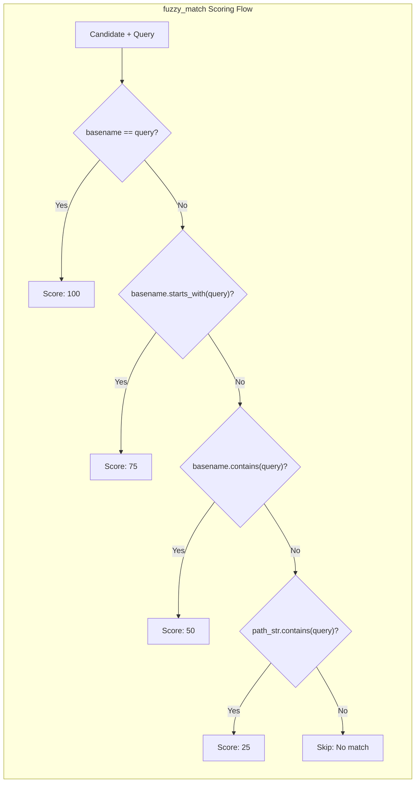

# Multi-Tier Scoring Algorithm

### From: fuzzy

A multi-tier scoring algorithm is a classification and ranking methodology that assigns discrete priority levels to matches based on match quality characteristics. Unlike continuous scoring systems that might produce numerically close results difficult to distinguish, tiered systems create clear semantic boundaries that align with user mental models of relevance. This approach is particularly valuable in search interfaces where explainability and predictable ordering directly impact user satisfaction.

The specific algorithm implemented uses four tiers with exponentially decreasing scores (100, 75, 50, 25), which creates natural gaps that prevent ambiguity between quality levels. The semantic assignment of these tiers reflects deep understanding of developer behavior: exact filename matches indicate precise intent, prefix matches suggest active typing completion, substring matches accommodate remembered fragments, and path matches handle cases where the query relates to organizational structure rather than specific filenames. This semantic grounding ensures that the numerical scores translate intuitively to perceived relevance.

The tiebreaker implementation—preferring shorter paths when scores are equal—adds a secondary optimization that surfaces less nested files. This heuristic leverages the observation that in most project structures, heavily nested files are implementation details while root-level and shallow files represent public APIs and primary entry points. The combination of primary tier scoring with secondary path-length optimization creates a ranking that feels intelligent without requiring machine learning or complex statistical models, demonstrating how thoughtful algorithm design can achieve sophisticated behavior through simple, understandable rules.

## Diagram

## External Resources

- [Wikipedia: Ranking in information retrieval](https://en.wikipedia.org/wiki/Ranking) - Wikipedia: Ranking in information retrieval
- [Wikipedia: Heuristic methods](https://en.wikipedia.org/wiki/Heuristic) - Wikipedia: Heuristic methods

## Sources

- [fuzzy](../sources/fuzzy.md)
