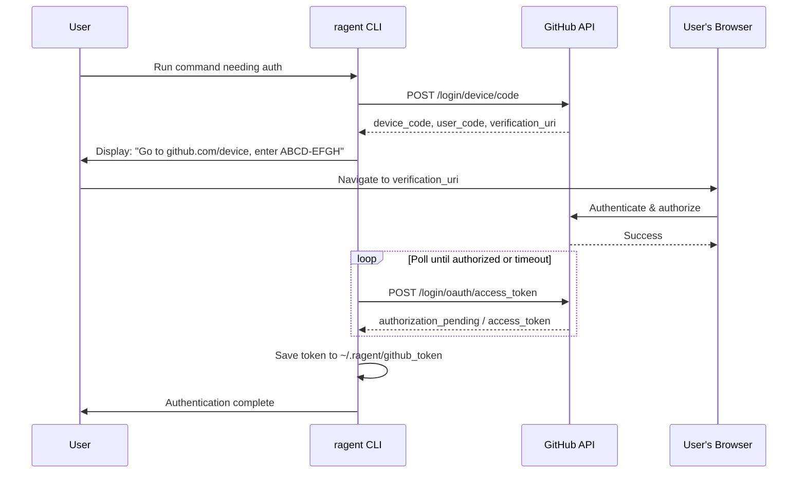

# OAuth 2.0 Device Authorization Grant

### From: mod

The OAuth 2.0 Device Authorization Grant (RFC 8628), commonly called device flow, is an OAuth 2.0 extension designed for devices with limited input capabilities or no browser access. Unlike the authorization code flow that redirects users to a browser, device flow presents a user code and verification URL that the user enters on a secondary device with full browser capabilities. This makes it ideal for CLI tools, smart TVs, IoT devices, and other constrained environments. The ragent GitHub module implements this through the `device_flow_login` function, enabling authentication on headless servers or terminal-only environments.

The device flow protocol involves a specific sequence: the client requests a device code from the authorization server, receives a user code and verification URL along with a polling interval, displays these to the user, then polls the token endpoint until the user completes authorization or a timeout expires. The user experience involves visiting the URL on a phone or computer, entering the displayed code, and granting permissions. This decoupling of the device running the software from the device performing authentication enables flexible deployment scenarios while maintaining security through short-lived, single-use codes and polling restrictions.

For GitHub specifically, device flow has become the recommended authentication method for CLI applications since GitHub deprecated password-based authentication for API access. GitHub's implementation requires apps to be registered for device flow, with rate limits and token expiration policies that differ from traditional personal access tokens. The ragent implementation must handle GitHub-specific extensions, error codes for pending authorization vs. denied access, and token refresh if using refresh tokens. The choice to implement device flow alongside file-based token storage indicates a mature authentication strategy supporting both initial setup and long-term automated operation.

## Diagram

## External Resources

- [RFC 8628: OAuth 2.0 Device Authorization Grant](https://datatracker.ietf.org/doc/html/rfc8628) - RFC 8628: OAuth 2.0 Device Authorization Grant
- [GitHub device flow documentation](https://docs.github.com/en/developers/apps/building-oauth-apps/authorizing-oauth-apps#device-flow) - GitHub device flow documentation
- [OAuth 2.0 Device Flow overview](https://oauth.net/2/device-flow/) - OAuth 2.0 Device Flow overview

## Related

- [Token Resolution Hierarchy](token-resolution-hierarchy.md)

## Sources

- [mod](../sources/mod.md)
