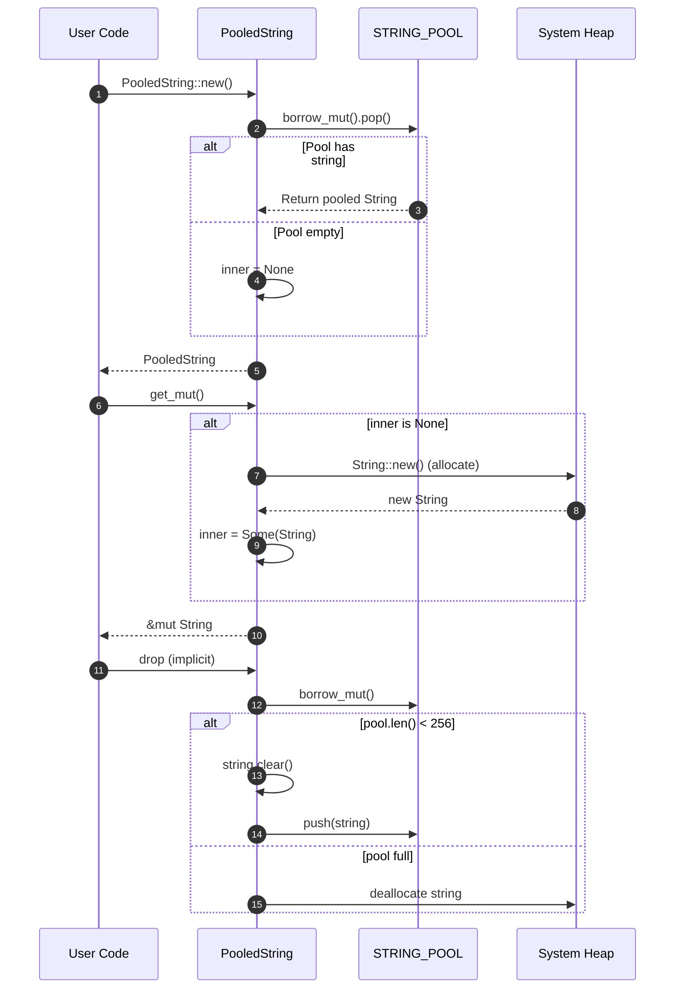

# Object Pooling

### From: pool

Object pooling is a creational design pattern that addresses performance concerns in systems with frequent allocation and deallocation of expensive resources. In the context of this Rust module, pooling is applied to String objects which, despite being stack-allocated for small strings (via the Small String Optimization in modern Rust), still frequently require heap allocation for message content. The fundamental insight behind pooling is that the cost of heap allocation—including system calls to the allocator, memory fragmentation, and cache pollution—often exceeds the cost of reusing an existing allocation, even when accounting for clearing the old content. This module implements a specific variant called thread-local pooling, where each execution thread maintains its own pool entirely independent of other threads. This design eliminates synchronization overhead that would be required for a global pool, at the cost of slightly reduced reuse efficiency (a string allocated on thread A cannot be reused on thread B). The trade-off is appropriate for message processing systems where work is typically assigned to specific threads and the volume of inter-thread string migration is low.

The pooling implementation follows a classic acquire-use-release pattern with Rust-specific adaptations. Acquisition happens in `PooledString::new()` through the `Vec::pop()` operation, which removes the most recently returned string from the pool (LIFO ordering). This LIFO behavior is beneficial for cache locality—the most recently used string is likely still hot in cache. Use proceeds through the `get_mut()` and `into_string()` methods which provide mutable access or ownership transfer. Release is automated through Rust's Drop trait, ensuring that strings are returned to the pool even in error paths and early returns—addressing a common source of pool leaks in manual pool implementations. The clearing of string content before return (`s.clear()`) is a deliberate design choice: it preserves the allocated capacity for reuse while allowing the next user to start with a clean slate. This is more efficient than reallocating from scratch while still providing safety against data leakage between users.

## Diagram

## External Resources

- [Object pool pattern - Wikipedia overview](https://en.wikipedia.org/wiki/Object_pool_pattern) - Object pool pattern - Wikipedia overview
- [Game Programming Patterns: Object Pool with performance analysis](https://gameprogrammingpatterns.com/object-pool.html) - Game Programming Patterns: Object Pool with performance analysis
- [Rust Object Pool pattern in Rust Design Patterns book](https://rust-unofficial.github.io/patterns/patterns/creational/object-pool.html) - Rust Object Pool pattern in Rust Design Patterns book

## Related

- [Thread-Local Storage](thread-local-storage.md)
- [Memory Churn Reduction](memory-churn-reduction.md)

## Sources

- [pool](../sources/pool.md)
