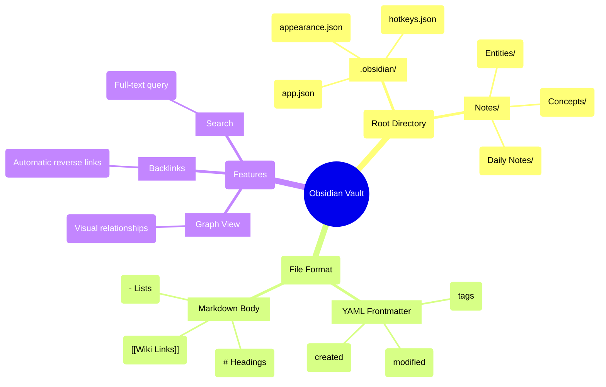

# Obsidian Vault Structure

### From: aiwiki_export

An Obsidian vault is a specific directory structure and file organization pattern designed for the Obsidian knowledge management application, which has become popular among researchers, writers, and knowledge workers for its powerful graph visualization and linking capabilities. The vault concept treats a folder of markdown files as a queryable knowledge database, where files are nodes and wiki-style links create edges in a traversable graph. This structure differs fundamentally from hierarchical file systems by emphasizing relationship-based organization over directory-based containment, though it respects filesystem conventions for portability.

The technical implementation of Obsidian vault export requires understanding several format conventions. File links use a double-bracket syntax `[[Page Title]]` that Obsidian resolves to matching filenames, with automatic handling of spaces and special characters. Metadata can be embedded in YAML frontmatter at the start of files, enabling properties like tags, creation dates, and custom fields that drive Obsidian's query language. The vault root contains configuration files in a `.obsidian` hidden directory, including appearance settings, hotkey definitions, and plugin configurations that customize the environment. AiwikiExportTool's obsidian export mode must generate this structure correctly for the vault to function as expected when opened in the application.

The choice to support Obsidian export reflects broader trends in personal knowledge management and the second brain movement, where individuals seek to build durable, searchable repositories of their learning and thinking. Unlike cloud-based note-taking applications, Obsidian's local-first approach aligns with AIWiki's design philosophy of user data ownership. The export functionality enables a workflow where agents capture and structure information during interactions, which users can then explore and extend using Obsidian's visualization tools. This bridges the gap between conversational AI's ephemeral nature and long-term knowledge building, creating persistent value from transient interactions. The graph view particularly complements AIWiki's entity and concept tracking, as relationships extracted by the agent become explorable visual structures.

## Diagram

## External Resources

- [Obsidian internal linking documentation](https://help.obsidian.md/Linking+notes+and+files/Internal+links) - Obsidian internal linking documentation
- [YAML frontmatter in Obsidian](https://help.obsidian.md/Editing+and+formatting/Metadata) - YAML frontmatter in Obsidian
- [Zettelkasten method - Influential PKM approach](https://www.zettelkasten.de/) - Zettelkasten method - Influential PKM approach

## Sources

- [aiwiki_export](../sources/aiwiki-export.md)
