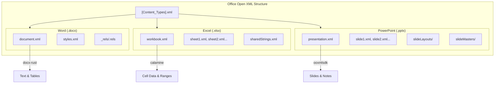

# Office Open XML Format

### From: office_read

Office Open XML (OOXML) is a standardized, XML-based file format developed by Microsoft for representing Word documents, Excel spreadsheets, and PowerPoint presentations, standardized as ECMA-376 and later ISO/IEC 29500. The format represents a fundamental shift from legacy binary Office formats, adopting a ZIP-archive structure where document components are stored as separate XML files with defined relationships, enabling modular access, easier corruption recovery, and programmatic manipulation. This architectural decision enables libraries like calamine and ooxmlsdk to access specific document parts without parsing entire files, dramatically improving performance for targeted extraction tasks.

The OOXML specification defines distinct schemas for each application: WordprocessingML for documents, SpreadsheetML for workbooks, and PresentationML for presentations. Each schema addresses domain-specific requirements—WordprocessingML handles complex paragraph and run properties with revision tracking; SpreadsheetML manages cell references, formulas, and calculation chains; PresentationML defines slide layouts, masters, and shape hierarchies. The office_read.rs implementation demonstrates practical engagement with these schemas: docx-rust abstracts WordprocessingML complexities, calamine provides SpreadsheetML access optimized for data extraction, and ooxmlsdk exposes PresentationML types for precise PowerPoint traversal. This multi-library approach reflects the specialization necessary for effective OOXML processing.

Despite standardization, OOXML implementation remains challenging due to schema complexity, version variations across Office releases, and extensive use of vendor extensions. The specification spans thousands of pages across multiple editions, with strict and transitional conformance classes that permit varying interpretation. Real-world documents often contain extensions or legacy compatibility features that strict parsers reject. This implementation handles such challenges through permissive parsing with `anyhow`-based error propagation, accepting best-effort extraction when perfect compliance is impossible. The format's dominance in enterprise document workflows makes robust OOXML support essential for document processing applications.

## Diagram

## External Resources

- [ECMA-376 Office Open XML standard](https://www.ecma-international.org/publications-and-standards/standards/ecma-376/) - ECMA-376 Office Open XML standard
- [ISO/IEC 29500 Office Open XML international standard](https://www.iso.org/standard/71691.html) - ISO/IEC 29500 Office Open XML international standard

## Related

- [Office Document Text Extraction](office-document-text-extraction.md)

## Sources

- [office_read](../sources/office-read.md)
