# ONNX Tensor Operations

### From: local

ONNX (Open Neural Network Exchange) tensor operations form the interface between Rust code and the optimized inference runtime, requiring careful handling of type systems, memory layouts, and shape semantics. The LocalEmbeddingProvider demonstrates the complete pipeline: constructing input tensors from tokenized data, marshaling them through the `ort` crate's type system, executing the model, and extracting results with appropriate shape handling. The input construction uses `ndarray::Array2` to create 2D tensors with batch and sequence dimensions, then converts to `ort::value::Tensor<i64>` through the `from_array()` and `into_dyn()` methods. The dynamic dimension handling (`into_dyn()`) allows runtime-sized sequences while maintaining type safety through the generic `i64` element type.

The tensor I/O design addresses several complexity layers in machine learning inference. First, shape validation: transformer models expect inputs with specific rank and dimension semantics—typically `[batch_size, sequence_length]` for token IDs and attention masks. The code constructs these shapes explicitly from the tokenizer output length, with the batch dimension fixed at 1 for single-example inference. Second, type conversion: token IDs from the tokenizer (typically `u32`) must be cast to `i64` to match the ONNX model's expected input types, performed through iterator mapping during array construction. Third, memory management: the `ort` crate handles ownership of underlying ONNX Runtime memory, with Rust's Drop implementation ensuring proper resource cleanup when tensors go out of scope.

Output tensor extraction presents additional challenges due to dynamic shapes and the variability in transformer model output conventions. The implementation handles two common cases: three-dimensional outputs `[batch_size, seq_len, hidden_dim]` requiring mean pooling, and two-dimensional outputs `[batch_size, hidden_dim]` where pooling was already performed during export. The `try_extract_array::<f32>()` method attempts to view the output memory as a Rust-accessible array without copying, falling back to dynamic shape inspection through `ArrayViewD` (dimension-generic array view) when the shape is unknown at compile time. The `as_slice()` method requires contiguous memory layout, adding another validation layer. This flexibility is essential for supporting different ONNX export configurations while maintaining correct semantic embeddings across model variants.

## Diagram

```mermaid
flowchart LR
    subgraph Tokens["Tokenized IDs"]
        ids["[2023, 5390, 2456]"]
        masks["[1, 1, 1]"]
    end
    subgraph Construction["Tensor Construction"]
        cast["Cast to i64"]
        shape["Shape [1, 3]"]
        nd["ndarray::Array2"]
        ort_tensor["ort::Tensor<i64>"]
        dyn["into_dyn() → Dyn"]
    end
    subgraph Inference["ONNX Inference"]
        session["Session.run()"]
        model["MiniLM-L6 Model"]
        outputs["Output tensors"]
    end
    subgraph Extraction["Output Extraction"]
        extract["try_extract_array::<f32>()"]
        view["ArrayViewD<f32>"]
        slice["as_slice()"]
        vec["Vec<f32>"]
    end
    ids & masks --> cast
    cast --> shape --> nd --> ort_tensor --> dyn
    dyn --> session
    session --> model --> outputs
    outputs --> extract --> view --> slice --> vec
```

## External Resources

- [ort crate documentation for Tensor type and tensor construction](https://docs.rs/ort/latest/ort/value/struct.Tensor.html) - ort crate documentation for Tensor type and tensor construction
- [ONNX specification: Core concepts and tensor fundamentals](https://onnx.ai/onnx/intro/concepts.html) - ONNX specification: Core concepts and tensor fundamentals

## Sources

- [local](../sources/local.md)
