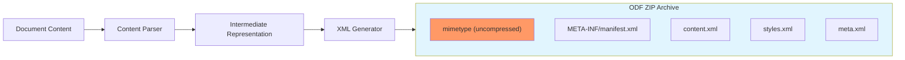

# OpenDocument Format (ODF) ZIP Archive Structure

### From: libreoffice_write

The OpenDocument Format specification mandates that all ODF documents—whether text, spreadsheets, or presentations—must be packaged as ZIP archives containing a specific set of XML files and directory structure. This architectural decision, inherited from the earlier OpenOffice.org XML format, provides several technical advantages: compression reduces file sizes, the ZIP format's ubiquity ensures broad tool support, and the internal file organization enables modular access to document components. Every valid ODF file must contain a `mimetype` file as the first uncompressed entry, which allows operating systems and applications to identify the document type without decompressing the entire archive. The `META-INF/manifest.xml` file serves as an inventory of all contained files and their MIME types, enabling validation and selective extraction. Core content resides in format-specific XML files: `content.xml` for the actual document body, `styles.xml` for formatting definitions, and `meta.xml` for document metadata. The implementation in libreoffice_write.rs demonstrates this structure explicitly through the `write_odt` and `write_odp` functions, which programmatically construct these archives using the `zip` crate. The code carefully observes the requirement that `mimetype` be stored uncompressed—achieved through `CompressionMethod::Stored`—while applying `CompressionMethod::Deflated` to other entries for space efficiency. This manual construction approach, while more labor-intensive than using a high-level ODF library, provides complete control over the output and eliminates external dependencies for document types where mature Rust libraries are unavailable.

## Diagram

## External Resources

- [ODF 1.3 Package specification](https://docs.oasis-open.org/office/OpenDocument/v1.3/OpenDocument-v1.3-part2-packages.html) - ODF 1.3 Package specification
- [OpenDocument Format Wikipedia article](https://en.wikipedia.org/wiki/OpenDocument) - OpenDocument Format Wikipedia article

## Sources

- [libreoffice_write](../sources/libreoffice-write.md)
