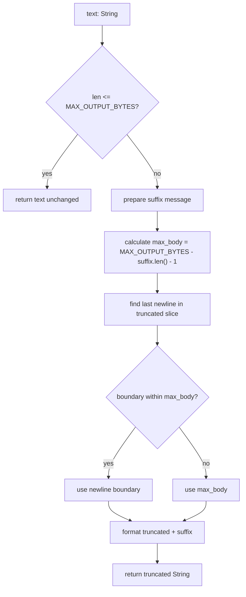

# Output Truncation and Resource Management

### From: office_common

Output truncation is a resource management technique used to limit the size of generated content, preventing excessive memory consumption and ensuring that downstream systems can handle results within their capacity constraints. The `truncate_output` function implements intelligent truncation that attempts to preserve the user experience by cutting at natural boundaries (newlines) when possible, rather than arbitrarily splitting content mid-line. The implementation sets a maximum output size of 100KB through the `MAX_OUTPUT_BYTES` constant, a threshold chosen to balance comprehensiveness against practical limits for display, logging, or transmission. When truncation occurs, the function appends a helpful message directing users toward more targeted access methods like range, sheet, or slide selection.

The truncation algorithm demonstrates careful attention to edge cases and user experience. It first checks if truncation is needed, avoiding unnecessary allocation for content within limits. When truncation is required, it calculates available space for the original content after accounting for the informational suffix message. It then searches backward from the truncation point for the last newline character, preferring to cut at a line boundary to avoid displaying partial lines. If no suitable newline exists within the allowed space, it falls back to a hard cutoff. This approach, using `saturating_sub` for safe arithmetic and `rfind` for reverse search, exemplifies defensive programming practices that prevent panics and produce clean output even with unexpected input.

The concept of output limits appears across many domains of computing, from database query result limits to API response size caps and terminal scrollback buffers. These limits serve multiple purposes: protecting server resources from unbounded growth, preventing denial-of-service through resource exhaustion, maintaining responsive user interfaces, and working within network protocol constraints. The specific mention of "range/sheet/slide selection" in the truncation message reveals the function's context within an Office document processing system, where large documents might contain extensive content and users need guidance on accessing specific portions. This user-facing aspect of the implementation shows how technical constraints can be communicated constructively, transforming a limitation into guidance toward more effective tool usage.

## Diagram

## External Resources

- [Rust String manipulation documentation](https://doc.rust-lang.org/std/string/struct.String.html) - Rust String manipulation documentation
- [Truncation concepts in computing](https://en.wikipedia.org/wiki/Truncation) - Truncation concepts in computing

## Related

- [Path Resolution in Multi-Context Applications](path-resolution-in-multi-context-applications.md)

## Sources

- [office_common](../sources/office-common.md)
