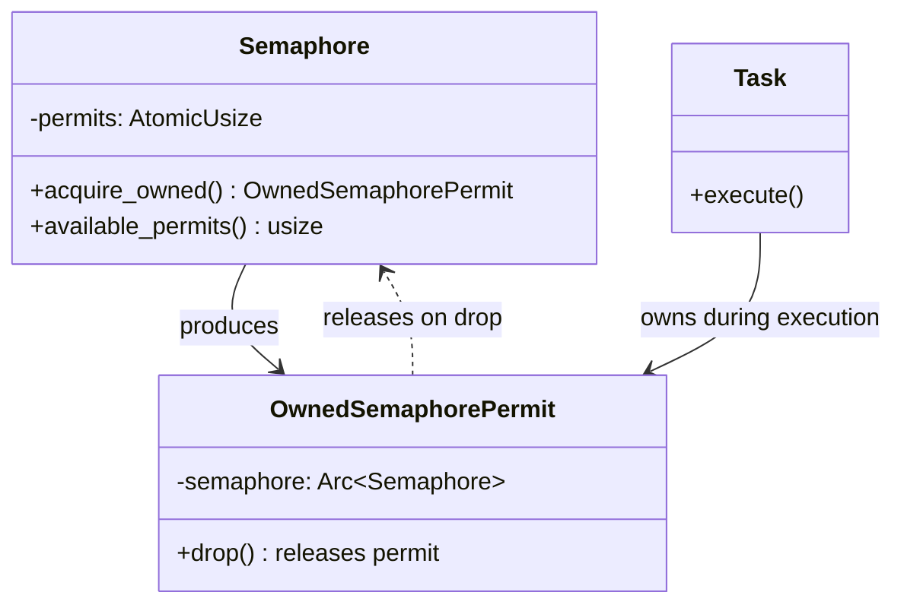

# Owned Permit Pattern

### From: resource

The owned permit pattern in Rust concurrency represents an ownership-based approach to resource acquisition that leverages the type system for automatic cleanup. Rather than holding a reference to a permit that must be explicitly released to a specific semaphore instance, OwnedSemaphorePermit is a Send-capable type that carries its release capability, enabling permits to move across task boundaries and thread boundaries without lifetime complications. This pattern is essential in this codebase because tool executions and process spawns occur in spawned async tasks that may outlive the calling context, making borrowed permits with lifetime parameters infeasible. The ownership semantics ensure that permits are released exactly once when the OwnedSemaphorePermit is dropped, even if the task panics or returns early through multiple code paths. The clone of the Arc<Semaphore> before acquisition ensures that the semaphore remains alive for the permit's full lifetime, preventing use-after-free scenarios. This pattern exemplifies Rust's "resource acquisition is initialization" (RAII) philosophy applied to async concurrency primitives.

## Diagram

## External Resources

- [OwnedSemaphorePermit API documentation](https://docs.rs/tokio/latest/tokio/sync/struct.OwnedSemaphorePermit.html) - OwnedSemaphorePermit API documentation
- [RAII patterns in Rust](https://rust-unofficial.github.io/patterns/idioms/raii.html) - RAII patterns in Rust

## Related

- [Global State Management in Async Rust](global-state-management-in-async-rust.md)

## Sources

- [resource](../sources/resource.md)
