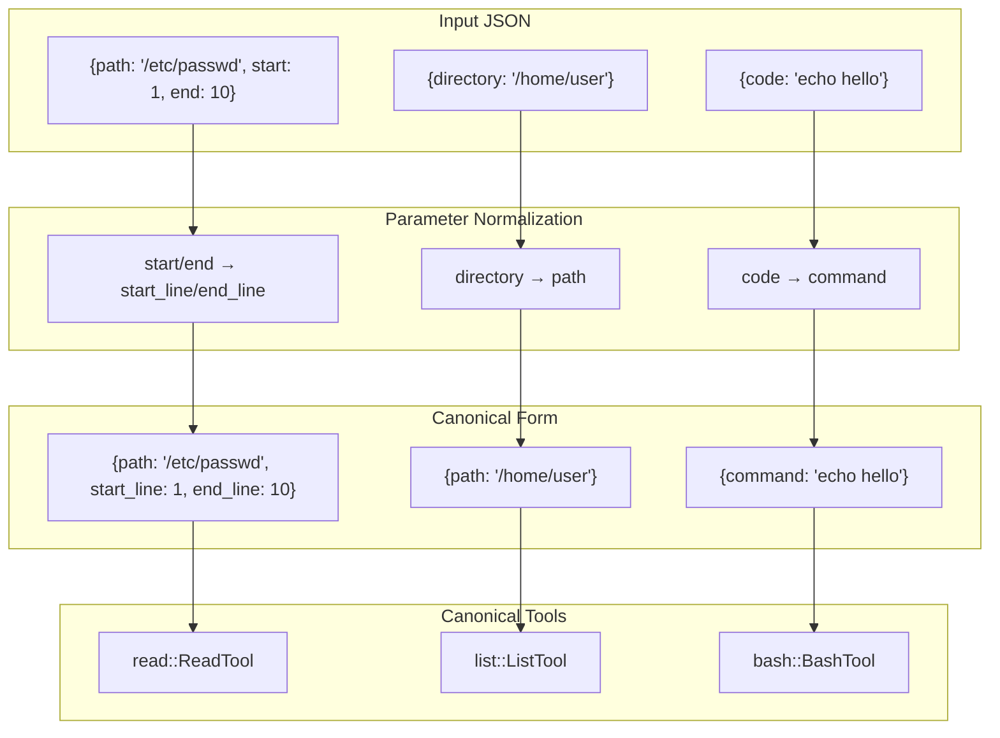

# Parameter Name Normalization

### From: aliases

Parameter name normalization is the process of transforming semantically equivalent but syntactically different parameter names into a canonical form before processing. In ragent's aliases module, this is implemented for cases like `start`/`end` versus `start_line`/`end_line` in file reading tools, `directory` versus `path` in listing tools, and `old`/`new` versus `old_str`/`new_str` in editing tools. The normalization logic typically checks if the canonical key exists, and if not, attempts to promote an alias value to the canonical position in the input JSON object.

This technique addresses a dimension of LLM variability orthogonal to tool name hallucination: even when models select the correct tool name, they may use parameter names that differ from the schema. This can occur because different frameworks use different conventions (Python's `start` vs Rust's `start_line`), because models generalize from similar APIs, or because natural language descriptions of parameters lead to predictable alternative namings. The `extract_command` function in ragent demonstrates sophisticated normalization, handling not just string-to-string mapping but also array-to-string transformation for shell commands where models might provide `["bash", "-c", "..."]` instead of a command string.

The implementation pattern in ragent uses mutable modification of the input Value, cloning values from alias keys to canonical keys before delegation. This approach maintains backward compatibility while allowing gradual migration to preferred schemas. The design reflects practical lessons from production agent systems where strict schema adherence causes friction, and where the cost of accepting multiple parameter names is low compared to the robustness gained. Normalization is particularly important for agent frameworks aiming to work with multiple model providers, as each may have subtly different tendencies in parameter naming derived from their training data.

## Diagram

## External Resources

- [JSON Schema specification for parameter validation](https://json-schema.org/) - JSON Schema specification for parameter validation
- [Serde serialization framework used in ragent](https://serde.rs/) - Serde serialization framework used in ragent

## Sources

- [aliases](../sources/aliases.md)
