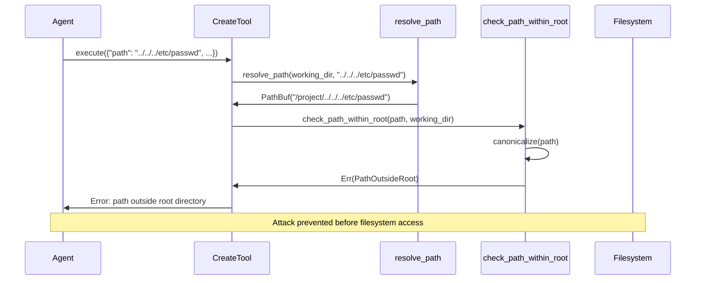

# Path Resolution Security

### From: create

Path Resolution Security encompasses techniques for safely handling filesystem paths in multi-tenant or sandboxed environments, preventing directory traversal attacks where malicious input attempts to access files outside intended boundaries. The CreateTool implementation demonstrates a defense-in-depth approach through its `resolve_path` helper function combined with the `check_path_within_root` validation. This two-layer security ensures that even if path manipulation succeeds at the string level, the final resolved path is verified to remain within the agent's designated working directory.

The attack vector being mitigated is path traversal (also known as directory climbing), where inputs like `"../../../etc/passwd"` attempt to escape a chroot-like restriction. The `resolve_path` function handles the first layer by joining relative paths to a working directory, but critically preserves absolute paths as-is—which is why the second layer is essential. The `check_path_within_root` call (defined in the parent module) performs canonicalization and prefix checking to ensure the resolved path is truly contained within the root. This pattern recognizes that path security is subtle: Rust's `Path::join` behavior, symlink following, and platform-specific path formats all create potential escape vectors.

Beyond direct security, this approach enables practical system designs where agents can be given intuitive path interfaces (relative paths from their working directory) while maintaining hard boundaries. The working directory acts as a capability—agents without access to paths outside their root cannot exfiltrate data or corrupt system files even if compromised. This pattern appears in container runtimes, web server configurations, and build systems, all of which need to process user-provided paths without trusting the user. The async nature of the actual file operations (via Tokio) adds complexity, as security checks must complete before any I/O begins to prevent race conditions between check and use.

## Diagram

## External Resources

- [OWASP Path Traversal attack documentation](https://owasp.org/www-community/attacks/Path_Traversal) - OWASP Path Traversal attack documentation
- [Rust standard library Path documentation](https://doc.rust-lang.org/std/path/struct.Path.html) - Rust standard library Path documentation

## Sources

- [create](../sources/create.md)
