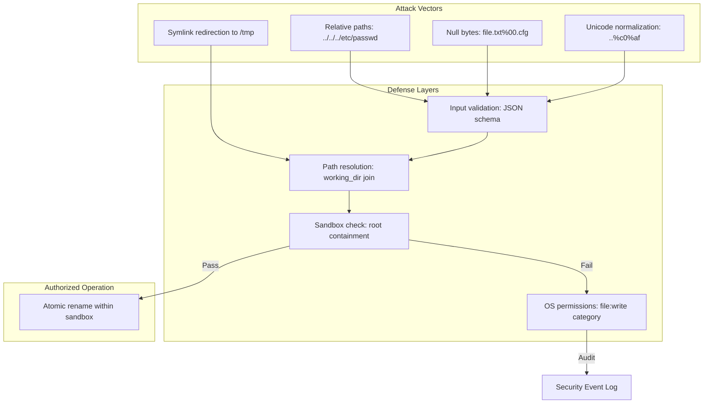

# Path Sandbox Security

### From: move_file

Path sandbox security is a defensive programming technique that constrains filesystem operations to a designated directory tree, preventing directory traversal attacks where malicious input might escape intended boundaries. MoveFileTool implements this through the check_path_within_root validation, which ensures both source and destination paths resolve to locations within the ToolContext's working_dir. This security model reflects the principle of least privilege, where even if an AI agent generates pathological path inputs like ../../../etc/passwd, the operation fails before reaching the operating system, containing potential damage within the authorized scope.

The implementation details of path sandboxing require careful attention to path normalization and symbolic link handling. MoveFileTool's resolve_path helper performs basic absolute/relative path resolution, but comprehensive sandboxing would additionally require canonicalization to resolve symlinks and eliminate .. components that might bypass simple string-prefix checks. The security-critical nature of these operations has led to numerous vulnerabilities in production systems, from web application path traversal to container escape exploits, demonstrating that correct implementation requires defense in depth with multiple validation layers.

Modern approaches to filesystem sandboxing extend beyond path validation to include capability-based security, namespace isolation through containers or chroot jails, and mandatory access control systems like SELinux or AppArmor. MoveFileTool's permission_category classification (file:write) enables integration with such systems, allowing administrators to apply principle-of-least-access policies at the tool level rather than relying solely on process-level restrictions. This layered security model acknowledges that AI agents may generate unexpected inputs and prepares for failure modes where agent behavior diverges from human intent, a critical consideration as autonomous systems gain broader access to computing resources.

## Diagram

## External Resources

- [OWASP path traversal attack patterns and defenses](https://owasp.org/www-community/attacks/Path_Traversal) - OWASP path traversal attack patterns and defenses
- [Security StackExchange sandbox implementation guidance](https://security.stackexchange.com/questions/12326/how-can-i-be-sure-that-im-using-sandboxes-correctly) - Security StackExchange sandbox implementation guidance

## Sources

- [move_file](../sources/move-file.md)
