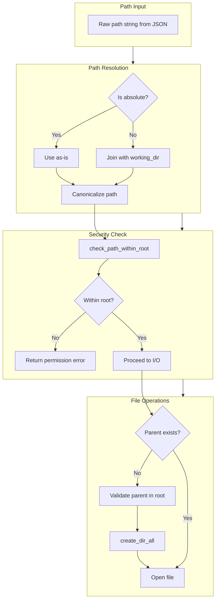

# Path Security and Directory Traversal Prevention

### From: append_file

Path security in file system tools addresses the critical vulnerability of directory traversal attacks, where malicious or buggy input could access files outside intended boundaries. The `AppendFileTool` implements defense-in-depth through multiple security layers: path resolution against a working directory, validation that resolved paths remain within the root, and careful handling of path separators and special components. These protections are essential for AI agent systems where tool inputs may originate from external or AI-generated sources with unpredictable content.

The `resolve_path` function demonstrates fundamental path resolution logic, handling both absolute and relative paths appropriately. Absolute paths (starting with `/` on Unix or drive letters on Windows) are used as-is, while relative paths are joined against the working directory. This mirrors shell behavior but in a controlled, programmatic context. The subsequent `check_path_within_root` call (referenced from the `super` module) performs the critical security validation, likely canonicalizing the path and verifying it remains within the allowed root directory tree, preventing `../` sequences from escaping the sandbox.

The security model extends to parent directory creation through `create_dir_all`, which must also respect the root boundary. The implementation's use of `PathBuf` and `Path` types from the standard library provides cross-platform path handling that correctly interprets platform-specific separators and conventions. For containerized or sandboxed agent deployments, these path controls form part of the defense perimeter, complementing OS-level confinement. The explicit error context on directory creation failures aids in diagnosing permission issues without leaking sensitive path information, balancing security with operational debugging needs.

## Diagram

## External Resources

- [OWASP Path Traversal attack description and prevention](https://owasp.org/www-community/attacks/Path_Traversal) - OWASP Path Traversal attack description and prevention
- [Rust standard library Path documentation](https://doc.rust-lang.org/std/path/struct.Path.html) - Rust standard library Path documentation
- [dunce crate for path normalization (common implementation approach)](https://docs.rs/dunce/latest/dunce/) - dunce crate for path normalization (common implementation approach)

## Sources

- [append_file](../sources/append-file.md)

### From: file_info

Path security in file system operations involves preventing unauthorized access to files outside intended boundaries, particularly defending against directory traversal attacks where manipulated path strings escape sandbox constraints. This codebase implements defense-in-depth through multiple layers: path resolution against a known working directory, validation that resolved paths remain within an authorized root, and careful use of metadata APIs that don't follow symbolic links in ways that could circumvent security checks.

The `resolve_path` function implements the first defense layer by interpreting relative paths against a controlled working directory and preserving absolute paths as-is. This ensures all paths are normalized to absolute form before security validation. The subsequent `check_path_within_root` call (imported from the parent module) performs the critical containment verification, likely implementing path canonicalization and prefix checking to detect attempted escapes through `..` components or symlink redirections. This two-phase approach—resolution then validation—is a security best practice that prevents time-of-check to time-of-use (TOCTOU) race conditions.

The use of `symlink_metadata` rather than `metadata` represents an additional security consideration. Standard metadata functions follow symbolic links, which could allow an attacker to create a symlink within the allowed directory that points to sensitive files outside it. By reading symlink metadata directly, the tool reports on the link itself, preventing indirect access to unauthorized targets. The permission category string `"file:read"` suggests integration with a capability-based security model where tools declare their access requirements and the framework enforces these declarations against policy configurations. This declarative security approach enables centralized audit and policy enforcement.
