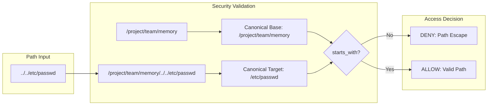

# Path Traversal Prevention

### From: team_memory_read

Path traversal prevention is a critical security concept implemented in this codebase to protect against directory escape attacks where malicious input could access files outside the intended memory directory. The implementation employs canonicalization, a process that resolves symbolic links, eliminates relative path components like `..`, and produces absolute path representations that can be reliably compared. By canonicalizing both the target directory and the requested file path, then verifying that the canonical target begins with the canonical directory prefix, the system establishes an effective containment boundary.

The defense in depth approach combines multiple validation layers: initial parameter extraction with default value handling, filesystem-based directory resolution through `find_team_dir`, memory scope validation, and finally the canonicalization-based path containment check. Each layer addresses different threat vectors, from missing parameters to manipulated relative paths attempting to escape via `../../` sequences. The use of `unwrap_or_else` fallbacks ensures that canonicalization failures don't inadvertently bypass security checks by producing incomparable paths.

This implementation pattern reflects industry best practices for secure filesystem access in applications that process untrusted path input, such as web applications, AI agents executing generated code, or any system where user input influences file operations. The Rust standard library's `canonicalize` method provides the necessary functionality, though its platform-specific behaviors (particularly regarding Windows path prefixes) require careful handling in cross-platform deployments. The explicit error return for path escape attempts, distinct from simple file-not-found errors, enables proper audit logging and incident response.

## Diagram

## External Resources

- [OWASP Path Traversal attack documentation](https://owasp.org/www-community/attacks/Path_Traversal) - OWASP Path Traversal attack documentation
- [Rust Path::canonicalize documentation](https://doc.rust-lang.org/std/path/struct.Path.html#method.canonicalize) - Rust Path::canonicalize documentation
- [CWE-22: Improper Limitation of a Pathname to a Restricted Directory](https://cwe.mitre.org/data/definitions/22.html) - CWE-22: Improper Limitation of a Pathname to a Restricted Directory

## Sources

- [team_memory_read](../sources/team-memory-read.md)

### From: team_memory_write

Path traversal prevention is a critical security mechanism protecting filesystem operations from malicious input crafted to escape designated directories. The attack vector, commonly known as directory traversal or path traversal, involves supplying relative path sequences like '../' or absolute paths that resolve outside intended boundaries. TeamMemoryWriteTool implements multi-layered defenses against this class of vulnerability, which is particularly severe in multi-agent systems where one compromised or malicious agent might attempt to read sensitive files or corrupt system configurations belonging to other agents or the host system.

The canonicalization-based defense strategy employed here represents industry best practice. Rather than attempting to sanitize paths through string manipulation—which is notoriously error-prone against Unicode normalization, case sensitivity, and symlink attacks—the implementation uses filesystem-level canonicalization via std::fs::canonicalize. This resolves all symbolic links, relative components, and case variations to absolute, normalized paths that can be reliably compared. The tool then verifies that the resolved target path begins with the canonicalized memory directory prefix, ensuring no escape is possible regardless of input crafting sophistication.

The implementation handles edge cases that often compromise security in similar systems. For non-existent target files, it validates against the parent directory's canonical location combined with the filename, preventing attacks that exploit race conditions between validation and file creation. The unwrap_or_else fallback to the original path ensures that canonicalization failures (e.g., on restricted filesystems) don't inadvertently bypass checks by returning empty or error values. These defensive depths demonstrate threat modeling appropriate to the risk profile of autonomous agent systems executing potentially adversarial code or processing untrusted user inputs that propagate into file operations.
